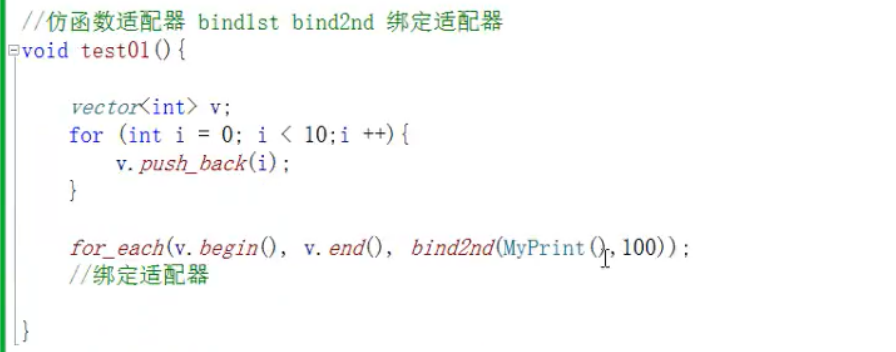
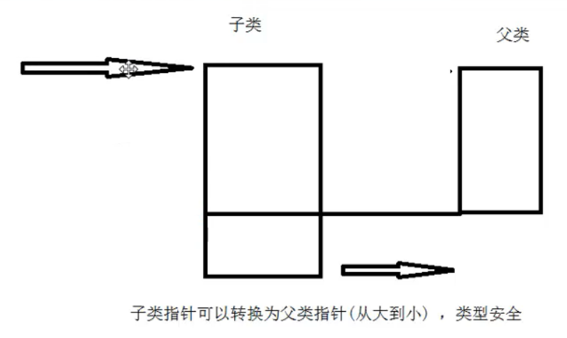
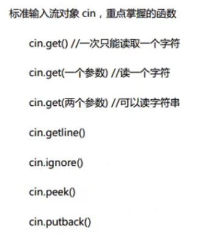

# 基础知识

## 数据类型

### 基本数据类型

`1.char 2. int 3. short 4. long 5. float 6.double 7.struct(自定义数据类型) 8. enum(枚举) 9.union(联合) 10.class(类) 11.template (类模板) 12.reference(引用) 13.void类型 14.指针类型`

| 类型（64位系统下）     | 位            |                             范围                             |
| :--------------------- | :------------ | :----------------------------------------------------------: |
| char                   | 1 个字节      |                  -128 到 127 或者 0 到 255                   |
| unsigned char          | 1 个字节      |                           0 到 255                           |
| signed char            | 1 个字节      |                         -128 到 127                          |
| int                    | 4 个字节      |    -2147483648 到 2 147 483 647（10^9）（2^31）（压缩DP）    |
| unsigned int           | 4 个字节      |                       0 到 4294967295                        |
| signed int             | 4 个字节      |                  -2147483648 到 2147483647                   |
| short int              | 2 个字节      |                       -32768 到 32767                        |
| unsigned short int     | 2 个字节      |                         0 到 65,535                          |
| signed short int       | 2 个字节      |                       -32768 到 32767                        |
| long long int          | 8 个字节      |   -9,223,372,036,854,775,808 到 9,223,372,036,854,775,807    |
| signed long long  int  | 8 个字节      |   -9,223,372,036,854,775,808 到 9,223,372,036,854,775,807    |
| unsigned long long int | 8 个字节      |         0 到 18,446,744,073,709,551,615   (2^64 - 1)         |
| float                  | 4 个字节      | 精度型占4个字节（32位）内存空间，+/- 3.4e +/- 38 (~7 个数字) |
| double                 | 8 个字节      | 双精度型占8 个字节（64位）内存空间，+/- 1.7e +/- 308 (~15 个数字) |
| long double            | 16 个字节     | 长双精度型 16 个字节（128位）内存空间，可提供18-19位有效数字。 |
| wchar_t                | 2 或 4 个字节 |                          1 个宽字符                          |

<font color="pink">signed和unsigned可以用来修饰char型和int型（包括long int），不能修饰bool、float、double和long double。</font>

## 运算符优先级

<font color="orange">运算符优先级：！> 算术运算符 > 关系运算符 > （&& ||）> 条件运算符> 赋值运算符 > 逗号运算符。</font>

| 优先级 | 操作符                              | 描述                                                         | 例子                                                         | 结合性       |
| ------ | ----------------------------------- | ------------------------------------------------------------ | ------------------------------------------------------------ | ------------ |
| 1      | () [] -> . :: ++  --                | 调节优先级的括号操作符 数组下标访问操作符 通过指向对象的指针访问成员的操作符 通过对象本身访问成员的操作符 作用域操作符 后置自增操作符 后置自减操作符 | (a + b) / 4; array[4] = 2; ptr->age = 34; obj.age = 34; Class::age = 2; for( i = 0; i < 10; i++ ) ... for( i = 10; i > 0; i-- ) ... | 从左到右     |
| 2      | ! ~ ++ -- - + * & (type) sizeof     | 逻辑取反操作符 按位取反(按位取补)  前置自增操作符 前置自减操作符 一元取负操作符 一元取正操作符 解引用操作符 取地址操作符 类型转换操作符 返回对象占用的字节数操作符 | if( !done ) ... flags = ~flags; for( i = 0; i < 10; ++i ) ... for( i = 10; i > 0; --i ) ... int i = -1; int i = +1; data = *ptr; address = &obj; int i = (int) floatNum; int size = sizeof(floatNum); | **从右到左** |
| 3      | ->* .*                              | 在指针上通过指向成员的指针访问成员的操作符 在对象上通过指向成员的指针访问成员的操作符 | ptr->*var = 24; obj.*var = 24;                               | 从左到右     |
| 4      | * / %                               | 乘法操作符 除法操作符 取余数操作符                           | int i = 2 * 4; float f = 10 / 3; int rem = 4 % 3;            | 从左到右     |
| 5      | + -                                 | 加法操作符 减法操作符                                        | int i = 2 + 3; int i = 5 - 1;                                | 从左到右     |
| 6      | << >>                               | 按位左移操作符 按位右移操作符                                | int flags = 33 << 1; int flags = 33 >> 1;                    | 从左到右     |
| 7      | < <= > >=                           | 小于比较操作符 小于或等于比较操作符 大于比较操作符 大于或等于比较操作符 | if( i < 42 ) ... if( i <= 42 ) ... if( i > 42 ) ... if( i >= 42 ) ... | 从左到右     |
| 8      | == !=                               | 等于比较操作符 不等于比较操作符                              | if( i == 42 ) ... if( i != 42 ) ...                          | 从左到右     |
| 9      | &                                   | 按位与操作符                                                 | flags = flags & 42;                                          | 从左到右     |
| 10     | ^                                   | 按位异或操作符                                               | flags = flags ^ 42;                                          | 从左到右     |
| 11     | \|                                  | 按位或操作符                                                 | flags = flags \| 42;                                         | 从左到右     |
| 12     | &&                                  | 逻辑与操作符                                                 | if( conditionA && conditionB ) ...                           | 从左到右     |
| 13     | \|\|                                | 逻辑或操作符                                                 | if( conditionA \|\| conditionB ) ...                         | 从左到右     |
| 14     | ? :                                 | 三元条件操作符                                               | int i = (a > b) ? a : b;                                     | **从右到左** |
| 15     | = +=  -= *= /= %= &= ^= \|= <<= >>= | 赋值操作符 复合赋值操作符(加法) 复合赋值操作符(减法) 复合赋值操作符(乘法) 复合赋值操作符(除法) 复合赋值操作符(取余) 复合赋值操作符(按位与) 复合赋值操作符(按位异或) 复合赋值操作符(按位或) 复合赋值操作符(按位左移) 复合赋值操作符(按位右移) | int a = b; a += 3; b -= 4; a *= 5; a /= 2; a %= 3; flags &= new_flags; flags ^= new_flags; flags \|= new_flags; flags <<= 2; flags >>= 2; | **从右到左** |
| 16     | ,                                   | 逗号操作符                                                   | for( i = 0, j = 0; i < 10; i++, j++ ) ...                    | 从左到右     |

**例子**

```c++
	int a[] = { 1,2,3 };
	int b[] = { 4,5,6 };
	int c[] = { 7,8,9 };
	int* arr[] = { a,b,c };
	cout << *arr[1] << endl;
	cout << (*arr)[1] << endl;
输出： 4 2
```


## 转义字符

| 转义字符 | 意义         | ASCII码值(十进制) |
| -------- | ------------ | ----------------- |
| \a       | 响铃(BEL)    | 007               |
| \b       | 退格(BS)     | 008               |
| \f       | 换页(FF)     | 015               |
| \n       | 换行(LF)     | 010               |
| \r       | 回车(CR)     | 013               |
| \t       | 水平制表(HT) | 009               |
| \v       | 垂直制表(VT) | 011               |
| `\\`     | 反斜杠       | 092               |
| \?       | 问号字符     | 063               |
| `\'`     | 单引号字符   | 039               |
| `\"`     | 双引号字符   | 034               |
| \0       | 空字符(NULL) | 000               |
| \ddd     | 任意字符     | 三位八进制        |
| \xhh     | 任意字符     | 二位十六进制      |

<font color="pink">“\”加数字（一般是8进制数字）来表示。</font>

常规的ASCII码，最大值是为0x7f，后面的从0x80到0xff为扩展ASCII码，不是标准的ASCII码.这些字符是用来表示框线、音标和其它欧洲非英语系的字母。

## 合法标识符，合法常量，合法转义字符

一， 合法标识符
用户定义的合法标识符需满足以下两个要求：

标识符只能由字母，数字和下划线组成。
<font color="orange">标识符不能以数字开头。</font>
二， 合法常量

整型常量：
十进制 ：10
八进制 ：017<font color="skyblue">（以0开头，不能出现8，9）</font>
十六进制：0xA1<font color="skyblue">（以0x开头）</font>

实型常量：（强调E）
E的前面必须有数字，<font color="skyblue">E的后面必须是整数</font>

字符型： 'n' ,'N' ,'\n'

字符串型："abc","123",""

三，合法转义字符

一般转义字符
\a 响铃
\b 退格
\f 换页
等

八进制转义字符
它是由反斜杠\ 和 随后的<font color="orange">1～3个</font>八进制数字构成的字符序列
一般形式是'\ddd'，d是0-9的数字。

十六进制转义字符
它是由反斜杠\ 和 <font color="orange">字母x(或X)</font>及随后的<font color="orange">1～2个</font>十六进制数字构成的字符序列
一般形式是'\xhh'，h是0-9或A-F内的一个。
<font color="pink">八进制转义字符和十六进制转义字符，不在前面加0！</font>

## ASCII

**ASCII中** 二进制数加后缀B，八进制数加后缀Q，十进制数加后缀D,十六进制数加后缀H,其中十进制的后缀D可以省略（默认）

## 隐显转换

- 隐式转换：<font color="orange">char->int->long->double 或 float->double（系统根据需要而自动转换）</font> 

- 显示转换：强制类型转换

- 尽量用显示转换代替隐式转换

  

## 开发一个C++程序的过程

通常包括编辑、编译、链接、运行和调试等步骤。


## GOTO

goto语句也称为无条件转移语句，其一般格式如下： goto 语句标号； 其中语句标号是按标识符规定书写的符号， 放在某一语句行的前面，标号后加冒号(：)。语句标号起标识语句的作用，与goto 语句配合使用。

如：

label: i++;

```c++
int main() {
	int x = 0;
loop:cout << "第" << x << "次到loop" << endl;
	if (x < 7) {
		x++;
		goto loop;
	}
	return 0;
}
输出：
    第0次到loop
    第1次到loop
    第2次到loop
    第3次到loop
    第4次到loop
    第5次到loop
    第6次到loop
    第7次到loop
```


### go to语句使用原则：

1、使用goto语句<font color="pink">只能goto到同一函数内，而不能从一个函数里goto到另外一个函数里。</font>

2、使用goto语句在同一函数内进行goto时，goto的起点应是函数内一段小功能的结束处，goto的目的label处应是函数内另外一段小功能的开始处。 

3、不能从一段复杂的执行状态中的位置goto到另外一个位置，比如，<font color="pink">从多重嵌套的循环判断中跳出去就是不允许的。</font>

4、应该避免向两个方向跳转。这样最容易导致"面条代码"。

## 内联函数

1. 内联函数在编译时将被调用函数代码直接编译到主调函数中，<font color="pink">因此不会产生"函数调用"开消。它不是指在一个函数内部定义另一个函数。</font>

2. 在C++中使用inline关键字来定义内联函数。inline关键字放在函数定义中函数类型之前。不过编译器会<font color="yellow">将在类的说明部分定义的任何函数都认定为内联函数，即使它们没有inline说明。</font>一个内联函数可以有，也可以没有return语句。内联函数在程序执行时并不产生实际函数调用，而是在函数调用处将函数代码展开执行。内联函数是通过编译器来实现的。

3. 在类<font color="pink">内部实现</font>的函数都是内联函数，可不用关键字inline定义；<font color="orange"> 只有函数外部定义的内联函数必须使用关键字inline。</font>

   下面案例中成员函数GetLength()和GetWidth()是内联函数。

   ```c++
   class Box{
   public:
          double GetLength(){ return length; }//<------
          double GetWidth();
          double GetHeight();
   private:
          double length, width, height;
   };
   inline double Box::GetWidth() { return width; }//<------
   double Box::GetHeight(){ return height; }
   在成员函数GetLenth、GetWidth和GetHeight中，内联函数有___2个__。
   ```

   在一个函数中，要求通过函数来实现一种不太复杂的功能，并且要求加快执行速度，选用 **内联函数**。


# Char相关知识

## Char数组的声明

### 静态方式

```c++
char*p = "Happy";// 其实它存的是H a p p y \0 这样
char a[]="Happy"; 等同于 char a[6] = {'H', 'a', 'p', 'p', 'y', '\0'};
//char a[5] = "Happy";//错误 数组越界 最后应有‘\0’
char a[5] = {'H','a','p','p','y'};等同于 char a[] = { 'H','a','p','p','y' };
```

#### 编译器带来的问题

```c++
//在devc++中可以
char* ch1 = "Hello world";

//在VS中不能用上面的方法 但可以用以下的方式
//1、先用另外的字符数组存储Hello world，再对字符型指针进行初始化
char ch2[] = "Hello world";
char* text = ch2;
//2、将char类型强转为char*
char* text = (char*)"Hello world";
```


### 动态方式

```c++
char*p = new char[n];//只能存n-1个字符，C++默认最后一个是字符串结束空字符。

char*target = new char[strlen(传入的字符串)+1];
或 char*target = new char[sizeof(传入的字符串)];

char*p = new char[6];
for(int i=0;i<6;i++)
{
  *(p+i) = 'A' + i;
}
// A B C D E F
```

## char数组的长度

```c++
char str1[] = "Myl";
cout << strlen(str1) << endl;//3
char str2[] = { 'M','y','l' };//等同于char str2[3] = { 'M','y','l' }
cout << strlen(str2) << endl;//随机数 因为不知道\0在哪里
char str3[] = { 'M','y','l' };
cout << strlen(str3) << endl;//随机数 因为不知道\0在哪里
```

<font color="orange">**strlen在使用时 在`DevC++`里需包含头文件：#include `<string.h>` 或`<cstring>`（考试注意）； 而在vs不需要**</font>

# string char* char[]的相互转换

## 一、string转char\*：

　　主要有三种方法可以将str转换为char*类型，分别是：data(); c_str(); copy();

  **data()方法**，如：

```c++
	string str = "hello";
	const char* p = str.data();//加const  或者用char * p=(char*)str.data();的形式
```

​	同时有一点需要说明，这里在dev c++中编译需要添加const，否则会报错invalid conversion from const   char*  to char *，这里可以再前面加上const或者在等号后面给强制转化成char*的类型。

​	下面解释下该问题，const char*是不能直接赋值到char*的,这样编译都不能通过,理由:假如可以的话,那么     通过char*就可以修改const char指向的内容了,这是不允许的。所以char*要另外开辟新的空间，即上面的     形式。

  **c_str()方法**，如：  

```c++
	string str=“world”;
	const char *p = str.c_str();//同上，要加const或者等号右边用char*
```

**copy()方法**，如：

```c++
	string str="hmmm";
	char p[50];
	str.copy(p, 5, 0);//这里5代表复制几个字符，0代表复制的位置，
	*(p+5)=‘\0’;//注意手动加结束符！！！
```

## 二、char \* 转string：

   可以直接赋值。

```c++
	string s;
	char *p = "hello";//直接赋值
	s = p;
```


   这里有一点要说明，当声明了string类型变量s后，用printf("%s",s);是会出错的，因为“%s”要求后面的对    象的首地址。但是string不是这样的一个类型。所以肯定出错。

## 三、string转char[]

   这个由于我们知道string的长度，可以根据length()函数得到，又可以根据下标直接访问，所以用一个循环就    可以赋值了。

```c++
	string pp = "dagah";
	char p[8];
	int i;
	for( i=0;i<pp.length();i++)
	    p[i] = pp[i];
	p[i] = '\0';
	printf("%s\n",p);
	cout<<p;
```

## 四、char[]转string

　　 这里可以直接赋值。

# sizeof

## sizeof语法

<font color="pink">**sizeof不是函数**</font>

​	1、用于变量名	sizeof(变量名) 或 sizeof 变量名

​	2、用于数据类型	sizeof(数据类型)

​	 <font color="orange">//除变量名的是这样的 eg： sizeof(char[20])</font>

​	sizeof(void) = 1;

## sizeof与strlen的区别

<font color="skyblue">sizeof是运算符，用于计算变量（或数据类型）**占用内存的字节数**；</font>
<font color="skyblue">strlen是函数，用于计算字符串的**实际长度**。</font>

```c++
char buf[20] = "hellow";
cout << sizeof(buf) << endl;//20
cout << strlen(buf) << endl;//6
```

```c++
char buf[] = "hellow";
cout << sizeof(buf) << endl;//7 多了个 \0
cout << strlen(buf) << endl;//6
```

### 在遍历时的区别

```c++
	char buf[] = "hellow";	
	for(int i = 0;i < sizeof(buf);i++){
		cout << "buf["<< i <<"]= " << buf[i]<<endl;
	}	
	cout << "----------------------------------"<<endl;	
	for(int i = 0;i < strlen(buf);i++){
		cout << "buf["<< i <<"]= " << buf[i]<<endl;
	}
输出 
buf[0]= h
buf[1]= e
buf[2]= l
buf[3]= l
buf[4]= o
buf[5]= w
buf[6]=
----------------------------------
buf[0]= h
buf[1]= e
buf[2]= l
buf[3]= l
buf[4]= o
buf[5]= w
    
    可以通过 sizeof(buf) - 1 来达到预期效果
```

## 用引用传数组参数

在C++中，有时候我们需要将数组作为参数传递到函数里去，常规的做法是：

```c++
void fun(int* a) {
    cout << sizeof(a); //这里会输出4或8(64位)，即a这个指针的大小
    //接着对数组进行操作
}
```

但是这种做法丢失了一部分信息，有没有更加符合“语法”的写法呢？答案是有的：

```c++
void fun2(int (&a)[100]) {
    cout << sizeof(a); //这里会输出400，即a数组的大小
    //接着对数组进行操作
}
```

当要想限定传入数组的大小时，可以用上述的写法，其意思为“对数组a的引用”。同时应当注意，这种写法可以安全的使用sizeof()函数。

<font color="pink">但只能传入的与 参数数组大小 对应的 数组变量</font>

```c++
void func3(int (&arr)[10]) {
	cout << "引用传入函数中" << "sizeof(arr) = " << sizeof(arr) << endl;
}

	int arr1[10] = { 0 };
	int arr2[2] = { 0 };
	func3(arr1);
	func3(arr2);//编译出错
```


## <font color="pink">数组当作函数参数传入时，会退化为指针</font>

```c++
void func(char buf[]){
	cout << "函数中" << "sizeof(buf)= "<< sizeof(buf) <<endl;	
}

void func1(char(&buf)[6]) {//参数这必须怎么写，传进来的参数也要是怎么大
	cout << "引用传入函数中" << "sizeof(buf)= " << sizeof(buf) << endl;
}

void func2(int arr[]){
	cout << "函数中" <<"sizeof(arr) = " << sizeof(arr) <<endl;
}

int main() {
	char buf[] = "abcde";
	cout << "sizeof(buf)= "<< sizeof(buf) <<endl;//sizeof(buf)= 6
    func(buf);//函数中sizeof(buf)= 4或8(64位)
    func1(buf);//引用传入函数中sizeof(buf)= 6
    
	int arr[] = {1,2,3};
	cout << "sizeof(arr) = " << sizeof(arr) <<endl;//sizeof(arr) = 12
	func2(arr);//函数中sizeof(arr) = 4或8(64位)
	return 0;
} 
```


# 数组

## 数组初始化

### 数组未定义

<font color="orange">普通数组没有赋初值，默认的数组元素值是随机数，不是0。</font>
如果在定义数组时，数据类型前面加上关键字static，数组变成了<font color="pink">静态数组</font>；或者把数组定义在函数的外面，成为<font color="pink">全局变量数组</font>，这时数组元素的值自动赋值为0。

### 初始化方式

```c++
	int arr1[10];//未初始化为随机值
	for (int i = 0; i < 10; i++)cout << arr1[i] << " ";
	cout << endl;
	cout << "-----------------------------------"<<endl;
	int arr2[10] = {};//用默认值补全后面的值
	for (int i = 0; i < 10; i++)cout << arr2[i] << " ";
	cout << endl;
	cout << "-----------------------------------"<<endl;
	int arr3[10] = { 0 };// 给第一个值 赋值为 0 后面用默认值（0）补全
	for (int i = 0; i < 10; i++)cout << arr3[i] << " ";
	cout << endl;
	cout << "-----------------------------------"<<endl;
	int arr4[10] = { 1 };//只有第一个元素是 1 而不是全部初始化为 1
	for (int i = 0; i < 10; i++)cout << arr4[i] << " ";
	cout << endl;
	cout << "-----------------------------------"<<endl;
	int arr5[10];
	memset(arr5,-1,sizeof(arr5));//在dev中 包含头文件 #include<cstring>
	//参数(数组，初始为值，字节数)
	for (int i = 0; i < 10; i++)cout << arr5[i] << " ";
	cout << endl;
	cout << "-----------------------------------"<<endl;
输出：
0 11865184 -1842097338 20 11865184 11865204 4663176 6 0 24
-----------------------------------
0 0 0 0 0 0 0 0 0 0
-----------------------------------
0 0 0 0 0 0 0 0 0 0
-----------------------------------
1 0 0 0 0 0 0 0 0 0
-----------------------------------
-1 -1 -1 -1 -1 -1 -1 -1 -1 -1
-----------------------------------
```


## <font color="orange">二维数组声明</font>

int (*p)[2]; //是一个列数为2，行数不确定的二维数组，同 int p [] [2];

int *p[2];  //是一个行数为2，列数不确定的<font color="skyblue">int指针数组</font>，它的每一个元素表示一个int指针

## 多维数组相关位置

### 	数组偏移

​	a为二维数组
​	1、&a+1跨整个变量。
​	2、a+1跨一维数组。
​	3、a[0]+1跨一个数据类型

```c++
a为二维数组//a[10][10]
*(a+0)=a[0][0]        第0行 
*(a+1)=a[1][0]        第1行 
*(a+2)=a[2][0]        第2行 
*(a+n)=a[n][0]        第n行 

*(*(a+0) + 0)=a[0][0] 第0行第0列 
*(*(a+0) + 1)=a[0][1] 第0行第1列 
*(*(a+1) + 0)=a[1][0] 第1行第0列 
*(*(a+1) + 1)=a[1][1] 第1行第1列
... 
*(*(a+n)+m)=a[n][m] 第n行第m列
```

```c++
	int a[3][3] = { {1,4,7},{2,5,8},{11,6,9} };
	cout << **a << endl;//1
	cout << *(*a + 2) << endl;//7
	cout << *(*a + 1) << endl;//4
	cout << **(a + 1) << endl;//2
	cout << **(a + 2) << endl;//11
	cout << *(*(a + 1)+1) << endl;//5
```


# 指针

## 指针相减

<font color="skyblue">结论：指针相减 = （地址1-地址2）/sizeof(数据类型)</font>

```c++
	int a[10] = {1,2,3,4,5,6,7,8,9,10};
   	int* p = a;
	int* m = p++;
    cout << "p= " << p << endl;
    cout << "m= " << m << endl;
    cout << "m - p = " << m - p <<endl;
    cout << "(char*)m - (char*)p = " << (char*)m - (char*)p <<endl;
输出 
p= 0x6bfeb0
m= 0x6bfeb4//地址相差 4个字节（int）
m - p = 1
(char*)m - (char*)p = 4
---------------------------------------------------------------------------------------
double g[] = { 1,2 };
double* buf= &g[1];
cout << "buf - g = " << buf - g << endl;
cout << "(int*)buf - (int*)g = " << (int*)buf - (int*)g << endl;
cout << "(double*)buf - (double*)g = " << (double*)buf - (double*)g << endl;
cout << "(char*)buf - (char*)g = " << (char*)buf - (char*)g << endl;
输出
buf - g = 1
(int*)buf - (int*)g = 2
(double*)buf - (double*)g = 1
(char*)buf - (char*)g = 8
```

## for+遍历

```c++
int a[10] = {1,2,3,4,5,6,7,8,9,10};
//1、
for(int i=0;i<10;i++)
   	cout << a[i] <<" ";
//2、
for(int* p=a;p<a+10;p++)
	cout << *p <<" ";
cout <<endl;
输出 1 2 3 4 5 6 7 8 9 10
```

## 深度理解数组和指针的关系

```c++
//int变量类型的指针
int num = 1;
int* m = &num;

//int数组的指针
int a[10] = { 0,1,2,3,4,5,6,7,8,9 };
int* p = a;//p的值为a的数组首地址
cout << a << endl;
cout << p << endl;
cout << &a << endl;//前3个都是一样的地址
cout << &p << endl;//输出的是 p指针 的地址 （不和前面的一样）

//cout << ++a << endl;数组是常量不可以改变
cout << a + 1 << endl;//但可以这样 不会改变a

cout << ++p << endl;//而指针可以改变 ++指向下一个索引的 地址
cout << &a[1] << endl;

p = a;//初始化
cout << *(p + 5) << endl; //输出5

p = a;//初始化
cout << a[3] << endl;
cout << p[3] << endl;//p可以像数组一样用[]
输出 
    3 3

p++//让p偏移
cout << a[3] << endl;
cout << p[3] << endl;
输出
    3 4
```

## 指针常量与常量指针

### <font color="orange">1.指针常量与常量指针的概念</font>

指针常量就是指针本身是常量，换句话说，就是指针里面所存储的内容（内存地址）是常量，不能改变。但是，内存地址所对应的内容是可以通过指针改变的。

常量指针就是指向常量的指针，换句话说，就是指针指向的是常量，它指向的内容不能发生改变，不能通过指针来修改它指向的内容。但是，指针自身不是常量，它自身的值可以改变，从而指向另一个常量。

### **2.指针常量与常量指针的声明**

指针常量的声明：数据类型 * <font color="yellow">const 指针变量</font>。

常量指针的声明： 数据类型 const <font color="yellow">* 指针变量</font>或者 const 数据类型 <font color="yellow">* 指针变量</font>。

常量指针常量的声明：数据类型 const * const 指针变量 或者 const 数据类型 * const 指针变量。

# 函数

### 函数重载条件

**作用：**函数名可以相同，提高复用性

**函数重载满足条件：**

- 同一个作用域下
- 函数名称相同
- 函数参数**类型不同** 或者 **个数不同** 或者 **顺序不同**

<font color="pink">**注意:** 函数的返回值不可以作为函数重载的条件</font>

在对函数进行重载时，不允许为其指定缺省参数

```c++
已知程序中已经定义了函数test，其原型是int test(int,int,int);，则下列重载形式中正确的是______。
    char test(int,int,int);//错
    double test(int,int,double);//对
	int test(int,int,int=0);//错
	float test(int,int,float=3.5F);//错
```


### 函数指针 

```c++
void func(int a){
    cout<<a<<endl;
}
int main(){
    void (*p)(int a);
    p = func;
    p(123);
    //输出123
    
    //可以定义一个像 类 一样的 函数指针
    typedef void (*P)(int a);
    P f = func;//初始化f
    f(333);
    P s =func;
    s(32331); 
}
```

# 类

## 类的六个默认成员函数

构造函数、拷贝构造函数、析构函数、赋值操作符重载、取地址操作符重载、const修饰的取地址操作符重载


## 构造函数、析构函数

<font color="pink">如果**我们不提供构造和析构，编译器会提供编译器提供的构造函数和析构函数是空实现。**</font>

- 构造函数：主要作用在于创建对象时为对象的成员属性赋值，构造函数由编译器自动调用，无须手动调用。

- 析构函数：主要作用在于对象**销毁前**系统自动调用，执行一些清理工作。

  <font color="orange">不可以手动调用构造函数，但是可以手动调用析构</font>

  <font color="skyblue">一个类只能定义一个析构函数</font>

注意1：调用无参构造函数不能加括号，如果加了编译器认为这是一个函数声明 `eg:Person p2()`

```c++
int main() {
	A fun();//声明
	fun();//调用
}

A fun() {//定义
	cout << "返回值为A类的函数" << endl;
	A a;
	return a;
}
```

```c++
class A{
public:
	A(string m):m_m(m){
		cout<< m_m <<"的构造函数的调用"<<endl; 
	}
	A(const A& p) {
		m_m = p.m_m + "的副本"; 
		cout<< m_m <<"的拷贝构造函数的调用"<<endl; 
	}
	~A(){
		cout<< m_m <<"的析构函数的调用"<<endl; 
	}
	string m_m;
};

int main()
{
	A("a0"); 
	/*a0的构造函数的调用
	a0的析构函数的调用*/
    ----------------------------------------------------------------------
	A a1("a1");
	A a2 = a1; 
	/*a1的构造函数的调用
	a1的副本的拷贝构造函数的调用
	
	a1的副本的析构函数的调用
	a1的析构函数的调用*/
    ----------------------------------------------------------------------
	A a3("a3");
	A a4(a3);
	/*a3的构造函数的调用
	a3的副本的拷贝构造函数的调用
	
	a3的副本的析构函数的调用
	a3的析构函数的调用*/
}
```

## 初始化列表方式初始化

```c++
 Person(int a, int b, int c) :m_A(a), m_B(b), m_C(c) {}
```

## 深拷贝与浅拷贝

浅拷贝：简单的赋值拷贝操作

深拷贝：在堆区重新申请空间，进行拷贝操作

```c++
//拷贝构造函数  
	Person(const Person& p) {
		cout << "拷贝构造函数!" << endl;
		//如果不利用深拷贝在堆区创建新内存，会导致浅拷贝带来的重复释放堆区问题
		m_age = p.m_age;
		m_height = new int(*p.m_height);
	}//类属性有 指针时需深拷贝
```

## <font color="orange">调用拷贝构造的情况</font>

用一个对象去初始化同一类的另一个新对象时

函数的返回值是类的对象，函数执行返回调用时	

函数的形参是类的对象，调用函数进行形参和实参结合时


## 静态成员

静态成员就是在成员变量和成员函数前加上关键字static，称为静态成员

静态成员分为：

- 静态成员变量
  - 所有对象共享同一份数据
  - 在编译阶段分配内存
  - 类内声明，类外初始化
- 静态成员函数
  - 所有对象共享同一个函数
  - <font color="orange">静态成员函数**只能访问静态成员变量**</font>

```c++
class Person
{
public:
	static int m_A; //静态成员变量
private:
	static int m_B; //静态成员变量也是有访问权限的
};
int Person::m_A = 10;
int Person::m_B = 10;
```

### 静态成员变量两种访问方式

1、通过对象 p1.m_A

2、通过类名 Person::m_A

//静态成员也是有访问权限的


## 对象模型和this指针

每个成员函数都有一个指针形参，它的名字是固定的，叫做this指针。this指针是隐式的，并且它是成员函数的第一个参数。<font color="orange">要注意的是构造函数、友元函数比较特殊，它没有this指针；</font>

### this指针的用途：

- 当形参和成员变量同名时，可用this指针来区分
- 在类的非静态成员函数中返回对象本身，可使用return *this

```c++
class Person
{
public:
	Person(int age)
	{
		//1、当形参和成员变量同名时，可用this指针来区分
		this->age = age;
	}
	Person& PersonAddPerson(Person p)
	{
		this->age += p.age;
		//返回对象本身
		return *this;
	}
	int age;
};
```

### 空指针访问成员函数

C++中空指针也是可以调用成员函数的，但是也要注意有没有用到this指针

如果用到this指针，需要加以判断保证代码的健壮性

```c++
class Person {
public:
	void ShowClassName() {
		cout << "我是Person类!" << endl;
	}
	void ShowPerson() {
		if (this == NULL) {//判断是否为NULL，可以来解决报错的问题
			return;
		}
		cout << mAge << endl;
	}
public:
	int mAge;
};
void test01()
{
	Person* p = NULL;
	p->ShowClassName(); //空指针，可以调用成员函数
	p->ShowPerson();  //但是如果成员函数中用到了this指针，就会报错 访问权限冲突
}
```

###  const修饰成员函数

**常函数：**

- 成员函数后加const后我们称为这个函数为**常函数**
- 常函数内不可以修改成员属性
- <font color="pink">成员属性声明时加关键字mutable后，在常函数中依然可以修改</font>

**常对象：**

- 声明对象前加const称该对象为常对象
- <font color="pink">常对象只能调用常函数</font>

```c++
class Person {
public:
	Person() {
		m_A = 0;
		m_B = 0;
	}
	//this指针的本质是一个指针常量，指针的指向不可修改
	//如果想让指针指向的值也不可以修改，需要声明常函数
	void ShowPerson() const {
		//const Type* const pointer;
		//this = NULL; //不能修改指针的指向 Person* const this;
		//this->mA = 100; //但是this指针指向的对象的数据是可以修改的

		//const修饰成员函数，表示指针指向的内存空间的数据不能修改，除了mutable修饰的变量
		this->m_B = 100;
	}
	void MyFunc() const {
		//mA = 10000;
	}
public:
	int m_A;
	mutable int m_B; //可修改 可变的
};
//const修饰对象  常对象
void test01() {
	const Person person; //常量对象  
	cout << person.m_A << endl;
	//person.mA = 100; //常对象不能修改成员变量的值,但是可以访问
	person.m_B = 100; //但是常对象可以修改mutable修饰成员变量

	//常对象访问成员函数
	person.MyFunc(); //常对象只能调用const的函数
}
```

## 友元

友元的目的就是让一个函数或者类 访问另一个类中私有成员

友元的关键字为 friend

友元的声明可以放在类的任何一个区域(公有、保护、私有)。<font color="orange">但是友元的实现不可以在类内部。</font>

<font color="orange">友元函数中不能使用this指针来访问类成员变量。</font>

### 友元的三种实现

- 全局函数做友元
- 类做友元
- 成员函数做友元

```c++
class Building {
    //告诉编译器 goodGay全局函数 是 Building类的好朋友，可以访问类中的私有内容 
    friend void goodGay(Building * building);
}
```

```c++
class Building
{
	//告诉编译器 goodGay类是Building类的好朋友，可以访问到Building类中私有内容
	friend class goodGay;
}
```

```c++
class Building
{
	//告诉编译器  goodGay类中的visit成员函数 是Building好朋友，可以访问私有内容
	friend void goodGay::visit();
}
```

## 运算符重载

运算符重载概念：对已有的运算符重新进行定义，赋予其另一种功能，以适应不同的数据类型

**运算符重载是多态性的一种表现**	

**对于运算符的重载，通常有两种形式。**
1、操作结果 operator 运算符(操作数1,[操作数2]) **两个操作数必须至少有一个自定义类**
2、操作结果 类::operator 运算符(操作数)

1.不能改变运算符的优先级。
2.不能改变运算符的结合性。
3.默认参数不能和重载的运算符一起使用，也就是说，<font color="orange">在设计运算符重载成员函数时不能使用默认函数。</font>
4.不能改变运算符的操作数的个数。
5.不能创建新的运算符，只有已有运算符可以被重载
6.运算符作用于C++内部提供的数据类型时，原来含义保持不变

`限制 "."，".*"，"->*"，"::"，"?:"，"sizeof"等操作符的重载。`<font color="pink">(带* . 的都不行)</font>

**必须在作为类成员函数重载的运算符：“=”、“[ ]”、“（）”、“->”**

**输入输出运算符不能重载为类的成员函数**

```c++
ostream& operator<<(ostream&,const 类对象引用)
istream& operator>>(istream&,类对象的引用)
```

### 重载加法运算符

```c++
//成员函数实现 + 号运算符重载
//类中含有两个成员变量 int m_A;int m_B; 
	Person operator+(const Person& p) {
		Person temp;
		temp.m_A = this->m_A + p.m_A;
		temp.m_B = this->m_B + p.m_B;
		return temp;
	}

//全局函数实现 + 号运算符重载
    Person operator+(const Person& p1, const Person& p2) {
        Person temp(0, 0);
        temp.m_A = p1.m_A + p2.m_A;
        temp.m_B = p1.m_B + p2.m_B;
        return temp;
    }

//运算符重载 可以发生函数重载 
    Person operator+(const Person& p2, int val)  
    {
        Person temp;
        temp.m_A = p2.m_A + val;
        temp.m_B = p2.m_B + val;
        return temp;
    }

//调用
	Person p1(10, 10);
	Person p2(20, 20);

	//成员函数方式
	Person p3 = p2 + p1;  //相当于 p2.operaor+(p1)
```

### 重载左移运算符

```c++
class Person {
	friend ostream& operator<<(ostream& out, Person& p);
public:
	Person(int a, int b)
	{
		this->m_A = a;
		this->m_B = b;
	}
	//成员函数 实现不了  p << cout 不是我们想要的效果
	//void operator<<(Person& p){
	//}
private:
	int m_A;
	int m_B;
};
//全局函数实现左移重载
//ostream对象只能有一个
ostream& operator<<(ostream& out, Person& p) {
	out << "a:" << p.m_A << " b:" << p.m_B;
	return out;
}

void test() {
	Person p1(10, 20);
	cout << p1 << "hello world" << endl; //链式编程
}
```

总结：重载左移运算符配合友元可以实现输出自定义数据类型

### 重载递增运算符

```c++
class MyInteger {
public:
	MyInteger() {
		m_Num = 0;
	}
	//前置++
	MyInteger& operator++() {
		//先++
		m_Num++;
		//再返回
		return *this;
	}

	//后置++
	MyInteger operator++(int) {
		//先返回
		MyInteger temp = *this; //记录当前本身的值，然后让本身的值加1，但是返回的是以前的值，达到先返回后++；
		m_Num++;
		return temp;
	}

private:
	int m_Num;
};
```

总结： 前置递增返回引用，后置递增返回值

### 重载赋值运算符

```c++
class Person
{
public:
	Person(int age)
	{
		//将年龄数据开辟到堆区
		m_Age = new int(age);
	}
	//重载赋值运算符 
	Person& operator=(Person &p)
	{
		if (m_Age != NULL)
		{
			delete m_Age;
			m_Age = NULL;
		}
		//编译器提供的代码是浅拷贝
		//m_Age = p.m_Age;

		//提供深拷贝 解决浅拷贝的问题
		m_Age = new int(*p.m_Age);

		//返回自身
		return *this;
	}
	~Person()
	{
		if (m_Age != NULL)
		{
			delete m_Age;
			m_Age = NULL;
		}
	}
	//年龄的指针
	int *m_Age;
};
```

**赋值运算符只能通过成员函数的方式进行重载**

### 重载关系运算符

```c++
class Person
{
public:
	Person(string name, int age)
	{
		this->m_Name = name;
		this->m_Age = age;
	};

	bool operator==(Person & p)
	{
		if (this->m_Name == p.m_Name && this->m_Age == p.m_Age)
		{
			return true;
		}
		else
		{
			return false;
		}
	}

	bool operator!=(Person & p)
	{
		if (this->m_Name == p.m_Name && this->m_Age == p.m_Age)
         {
			return false;
		}
		else
		{
			return true;
		}
	}

	string m_Name;
	int m_Age;
};
```

### 重载函数调用运算符

- 函数调用运算符 () 也可以重载
- 由于重载后使用的方式非常像函数的调用，因此称为仿函数
- 仿函数没有固定写法，非常灵活

```c++
class MyPrint
{
public:
	void operator()(string text)
	{
		cout << text << endl;
	}
};
void test01()
{
	//重载的（）操作符 也称为仿函数
	MyPrint myFunc;
	myFunc("hello world");
}


class MyAdd
{
public:
	int operator()(int v1, int v2)
	{
		return v1 + v2;
	}
};

void test02()
{
	MyAdd add;
	int ret = add(10, 10);
	cout << "ret = " << ret << endl;

	//匿名对象调用  
	cout << "MyAdd()(100,100) = " << MyAdd()(100, 100) << endl;
}
```

### 重载类型转换运算符

**在类型转换符函数的定义中不需要声明返回类型**

```c++

```

<font color="red">未学</font>

## 继承

继承的好处：可以减少重复的代码

class A : public B;

A 类称为子类 或 派生类

B 类称为父类 或 基类

**派生类中的成员，包含两大部分**：

一类是从基类继承过来的，一类是自己增加的成员。

从基类继承过过来的表现其共性，而新增的成员体现了其个性。


**结论： 父类中私有成员也是被子类继承下去了，只是由编译器给隐藏后访问不到**

如果不显式地给出继承方式，<font color="pink">缺省的继承方式是私有继承。</font>

```C++
class A {
public:
	int a;
};
class B : A{

};
```


### 继承中构造和析构顺序

建立派生类对象时，构造函数的执行顺序是，执行**虚拟基类**的构造函数，再是**非虚拟基类**然后执行**派生类成员对象**的构造函数，执行**派生类的构造函数**。最后是**非类对象成员**。

```c++
class Base 
{
public:
	Base()
	{
		cout << "Base构造函数!" << endl;
	}
	~Base()
	{
		cout << "Base析构函数!" << endl;
	}
};

class Son : public Base
{
public:
	Son()
	{
		cout << "Son构造函数!" << endl;
	}
	~Son()
	{
		cout << "Son析构函数!" << endl;
	}
};
int main() {
	Son s; 
}
输出：
    Base构造函数!
    Son构造函数!
    Son析构函数!
    Base析构函数!
```

### 继承同名成员处理方式

问题：当子类与父类出现同名的成员，如何通过子类对象，访问到子类或父类中同名的数据呢？

- 访问子类同名成员 直接访问即可
- 访问父类同名成员 需要加作用域
- 同名静态成员处理方式和非静态处理方式一样，只不过有两种访问的方式（通过对象 和 通过类名）

### 继承中析构函数的奇妙特点

```c++
class Base {
public:
	Base() {
		cout << "调用Base的构造函数" << endl;
	}
	~Base()
	{
		cout << "调用Base的析构函数" << endl;
	}
};
class Son :public Base{
public:
	Son() {
		cout << "调用Son的构造函数" << endl;
	}
	~Son()
	{
		cout << "调用Son的析构函数" << endl;
	}
};
class Grandson :public Son{
public:
	Grandson() {
		cout << "调用Grandson的构造函数" << endl;
	}
	~Grandson()
	{
		cout << "调用Grandson的析构函数" << endl;
	}
};

int main() {
	Grandson s;
	/*
	调用Base的构造函数
	调用Son的构造函数
	调用Grandson的构造函数
	调用Grandson的析构函数
	调用Son的析构函数
	调用Base的析构函数
	*/
	s.~Grandson();
	/*
	调用Grandson的析构函数
	调用Son的析构函数
	调用Base的析构函数
	*/
	return 0;
}
```

**总结：调用类对象自己析构函数之后会自动调用 父类的 析构函数**

### 继承中遇到的构造函数问题

总结：

子类在构造时，如果没有显式调用父类的构造函数，会先调用父类的默认构造函数（无参数的）

```c++
#include <iostream>
class Base{
public:
	Base(int a){}
};
class Derive:public Base{
public:
	Derive(int a,int b):Base(a){}//除了 父类有 无参构造函数时，不用这种写法，其他情况都需要有 父类初始化
};

int main(){
Derive c(1,2);
return 0;
}
```

### 虚继承

在采用虚基类时，其成员将仅存唯一的副本，这样就可以解决二义性问题，但不能够实现运行时多态，可通过抽象类或虚拟函数来实现，虚基类的构造函数将会首先被执行。


## 多态

### 多态的基本概念

**多态是C++面向对象三大特性之一**

多态分为两类

- 静态多态: 函数重载 和 运算符重载属于静态多态，复用函数名
- 动态多态: 派生类和虚函数实现运行时多态

静态多态和动态多态区别：

- 静态多态的函数地址早绑定 - 编译阶段确定函数地址
- 动态多态的函数

地址晚绑定 - 运行阶段确定函数地址


### 虚函数

虚函数是一种单界面多实现版本的实现方法，即函数名、返回类型、函数类型和个数顺序完全相同，但函数体内容可以完全不同。

基类中采用virtual说明一个虚函数后，<font color="orange">派生类中定义相同原型函数时可不必加virtual说明</font>

<font color="pink">虚函数不允许说明成静态的成员函数</font>


## 纯虚函数和抽象类

在多态中，通常父类中虚函数的实现是毫无意义的，主要都是调用子类**重写**的内容

因此可以将虚函数改为**纯虚函数**

纯虚函数语法：`virtual 返回值类型 函数名 （参数列表）= 0 ;`

当类中有了纯虚函数，这个类也称为抽象类

**抽象类特点**：

- 无法实例化对象
- 子类必须重写抽象类中的纯虚函数，否则也属于抽象类

```c++
class Base
{
public:
	virtual void func() = 0;
};

class Son :public Base
{
public:
	virtual void func() 
	{
		cout << "func调用" << endl;
	};
};

void test01()
{
	Base * base = NULL;
	//base = new Base; // 错误，抽象类无法实例化对象
	base = new Son;
	base->func();
	delete base;//记得销毁
}
```

### 虚析构和纯虚析构

多态使用时，如果子类中有属性开辟到堆区，那么父类指针在释放时无法调用到子类的析构代码

解决方式：将父类中的析构函数改为**虚析构**或者**纯虚析构**

虚析构和纯虚析构共性：

- 可以解决父类指针释放子类对象
- 都需要有具体的函数实现

虚析构和纯虚析构区别：

- 如果是纯虚析构，该类属于抽象类，无法实例化对象

虚析构语法：

```c++
virtual ~类名(){}
```

纯虚析构语法：

```c++
virtual ~类名() = 0;
类名::~类名(){}
```

```c++
class Animal {
public:
	Animal()
	{
		cout << "Animal 构造函数调用！" << endl;
	}
	virtual void Speak() = 0;

	//析构函数加上virtual关键字，变成虚析构函数
	//virtual ~Animal()
	//{
	//	cout << "Animal虚析构函数调用！" << endl;
	//}
	virtual ~Animal() = 0;
};
Animal::~Animal()
{
	cout << "Animal 纯虚析构函数调用！" << endl;
}

//和包含普通纯虚函数的类一样，包含了纯虚析构函数的类也是一个抽象类。不能够被实例化。

class Cat : public Animal {
public:
	Cat(string name)
	{
		cout << "Cat构造函数调用！" << endl;
		m_Name = new string(name);
	}
	virtual void Speak()
	{
		cout << *m_Name <<  "小猫在说话!" << endl;
	}
	~Cat()
	{
		cout << "Cat析构函数调用!" << endl;
		if (this->m_Name != NULL) {
			delete m_Name;
			m_Name = NULL;
		}
	}
public:
	string *m_Name;
};

void test01()
{
	Animal *animal = new Cat("Tom");
	animal->Speak();

	//通过父类指针去释放，会导致子类对象可能清理不干净，造成内存泄漏
	//怎么解决？给基类增加一个虚析构函数
	//虚析构函数就是用来解决通过父类指针释放子类对象
	delete animal;
}
int main() {
	test01();
	system("pause");
	return 0;
}
```

总结：

  1. 虚析构或纯虚析构就是用来解决通过父类指针释放子类对象

  2. 如果子类中没有堆区数据，可以不写为虚析构或纯虚析构

  3. 拥有纯虚析构函数的类也属于抽象类


## 多态案例

```c++
#include <iostream>
using namespace std;
#include<string>
//木材
class Wood {
protected:
	string name;
	int weight;
public:
	Wood(string n ,int w):name(n),weight(w){}
	virtual void Show() {//虚函数
		cout << "这是一块重" << weight << "kg的" << name << endl;
	}
};
//凳子
class Stool :public Wood{
public:
	Stool(string n , int w):Wood(n,w){}
	void Show() {//虚函数
		cout << "这是用一块重" << weight << "kg的" << name << "做的凳子" << endl;
	}
};
//桌子
class Dest :public Wood {
public:
	Dest(string n, int w) :Wood(n, w) {}
	void Show() {//虚函数
		cout << "这是用一块重" << weight << "kg的" << name << "做的桌子" << endl;
	}
};

void test(Wood* p) {
	p->Show();
}

int main() {
	Wood w1("橡木", 5), w2("楠木", 6);
	Stool s1("橡木", 5), s2("楠木", 6);
	Dest d1("橡木", 5), d2("楠木", 6);

	w1.Show();
	w2.Show();
	cout << "------------------------------" << endl;
	s1.Show();
	s2.Show();
	cout << "------------------------------" << endl;
	d1.Show();
	d2.Show();

	/*
	这是一块重5kg的橡木
	这是一块重6kg的楠木
	------------------------------
	这是用一块重5kg的橡木做的凳子
	这是用一块重6kg的楠木做的凳子
	------------------------------
	这是用一块重5kg的橡木做的桌子
	这是用一块重6kg的楠木做的桌子
	*/

	cout << "------------------------------" << endl;
	Wood* p;//多肽的体现 同样的指针有不同的结果
	p = &w1;
	test(p);
	cout << "------------------------------" << endl;
	p = &s1;
	test(p);
	cout << "------------------------------" << endl;
	p = &d1;
	test(p);

	/*这是一块重5kg的橡木
	------------------------------
	这是用一块重5kg的橡木做的凳子
	------------------------------
	这是用一块重5kg的橡木做的桌子*/
    
    /*如果没加virtual 则全为“这是一块重5kg的橡木”*/
    
    //引用也可以
    Dest d1("楠木", 10);
	Wood* W1;
	W1 = &d1;
	W1->Show();
    
	return 0;
}
```

**多肽的实现靠的是虚函数表**


虚函数表是链表

## 重载、重写、重定义

**函数重载（overload）**
函数重载是指在一个类中声明多个名称相同但参数列表不同的函数，这些的参数可能个数或顺序，类型不同，但是不能靠返回类型来判断。特征是：
（1）相同的范围（在同一个作用域中）；
（2）函数名字相同；
（3）参数不同；
（4）virtual 关键字可有可无（注：函数重载与有无virtual修饰无关）；
（5）返回值可以不同；

**函数重写（也称为覆盖 override）**
函数重写是指子类重新定义基类的虚函数。特征是：
（1）不在同一个作用域（分别位于派生类与基类）；
（2）函数名字相同；
（3）参数相同；
（4）基类函数必须有 virtual 关键字，不能有 static 。
（5）返回值相同，否则报错；
（6）重写函数的访问修饰符可以不同；

**重定义（也称隐藏）**
（1）不在同一个作用域（分别位于派生类与基类） ；
（2）函数名字相同；
（3）返回值可以不同；
（4）参数不同。此时，不论有无 virtual 关键字，基类的函数将被隐藏（注意别与重载以及覆盖混淆）；
（5）参数相同，但是基类函数没有 virtual关键字。此时，基类的函数被隐藏（注意别与覆盖混淆）；

## 其他

```c++
class Name{
   char name[20];
public:
   Name(){
      strcpy(name,"");
   }
   Name(char *fname){
      strcpy(name,fname);
   }
};
```

### 类中有char*案例

```c++
#include<iostream>
using namespace std;
#include<cstring>

class String{
private:
	char* buf;
public:
	String(char* sorce){
		buf = new char[strlen(sorce)+1];
		strcpy(buf,sorce);
		buf[strlen(sorce)+1]='\0';
	}
	bool operator==(String& s){
		cout<<"this:"<< this->buf <<endl;
		cout<<"s:"<< s.buf <<endl;
		cout<<"this的地址: "<< &(this->buf)<<endl; 
		cout<<"s的地址: "<< &(s.buf) <<endl; 
		cout<<"类里的bool值:"<<(this->buf==s.buf)<<endl; 
		if(strcmp(this->buf,s.buf)==0) return true;
		return false;
	}
	~String(){
		delete []buf;
		buf =NULL;
	} 
};
int main(){
	char* a="abc";
	char* b="abc";	
    cout<< (a==b) <<endl;
	cout<<"a的地址: "<< &a<<endl; 
	cout<<"b的地址: "<< &b<<endl; 
	String s1(a),s2(b);
	if(s1==s2)cout<<"true"<<endl;
	else cout<<"false"<<endl; 
	return 0; 
}
输出：
1
a的地址: 0x6bfeec
b的地址: 0x6bfee8
this:abc
s:abc
this的地址: 0x6bfee4
s的地址: 0x6bfee0
类里的bool值:0
true
```


# C++类所占内存大小计算

`class A {};`
`sizeof( A ) = ?`
`sizeof( A ) = 1`
`明明是空类，为什么编译器说它是1呢？`
**1、空类同样可以实例化，每个实例在内存中都有一个独一无二的地址，为了达到这个目的，编译器往往会给一个空类隐含的加一个字节，这样空类在实例化后在内存得到了独一无二的地址．所以sizeof( A )的大小为1．**

`class B`
`{`
`public:`
  `B() {}`
  `~B() {}`
  `void MemberFuncTest( int para ) { }`
  `static void StaticMemFuncTest( int para ){  }`
`};`
`sizeof( B ) = ?`
`sizeof( B ) = 1`

**2、类的非虚成员函数是不计算在内的,不管它是否静态。**

`class C`
`{`
 `C(){}`
 `virtual ~C() {}`
`};`
`sizeof( C ) = ?`
`sizeof( C ) = 4`

**3、类C有一个虚函数，存在虚函数的类都有一个一维的虚函数表叫虚表，虚表里存放的就是虚函数的地址了，因此，虚表是属于类的。这样的类对象的前四个字节是一个指向虚表的指针，类内部必须得保存这个虚表的起始指针。在32位的系统分配给虚表指针的大小为4个字节，所以最后得到类C的大小为4．**

`class D`
`{`
 `D(){}`
 `virtual ~D() {}`
 `virtual int VirtualMemFuncTest1()=0;`
 `virtual int VirtualMemFuncTest2()=0;`
 `virtual int VirtualMemFuncTest3()=0;`
`};`
`sizeof( D ) = ?`
`sizeof( D ) = 4`

**4、原理同类C，不管类里面有多少个虚函数，类内部只要保存虚表的起始地址即可，虚函数地址都可以通过偏移等算法获得。**

`class E`
`{`
 `int m_Int;`
 `char m_Char;`
`};`
`sizeof( E ) = ?`
`sizeof( E ) = 8`

**5、32位的操作系统int占4个字节，char占一个字节，加上内存对齐的3字节，为8字节。**

`class F : public E`
`{`
 `static int s_data ;`
`};`
`int F::s_data=100;`
`sizeof( F ) = ?`
`sizeof( F ) = 8`

**6、类F为什么跟类E一样大呢？类F的静态数据成员被编译器放在程序的一个global data members中，它是类的一个数据成员,但是它不影响类的大小,不管这个类实际产生了多少实例还是派生了多少新的类，静态成员数据在类中永远只有一个实体存在，而类的非静态数据成员只有被实例化的时候，他们才存在．但是类的静态数据成员一旦被声明，无论类是否被实例化，它都已存在．可以这么说，类的静态数据成员是一种特殊的全局变量.**

`class G : public E`
`{`
 `virtual int VirtualMemFuncTest1(int para)=0;`
 `int m_Int;`
`};`
`class H : public G`
`{`
 `int m_Int;`
`};`
`sizeof( G ) = ?`
`sizeof( H ) = ?`
`sizeof( G ) = 16`
`sizeof( H ) = 20`

**7、可以看出子类的大小是本身成员的大小再加上父类成员的大小.如果父类还有父类，也加上父类的父类，这样一直递归下去。**

`class I : public D`
`{`
 `virtual int VirtualMemFuncTest1()=0;`
 `virtual int VirtualMemFuncTest2()=0;`
`};`
`sizeof( I ) = ?`
`sizeof( I ) = 4`

**8、父类子类工享一个虚函数指针，虚函数指针保留一个即可。**

### 总结：

`空的类也是会占用内存空间的，而且大小是1，原因是C++要求每个实例在内存中都有独一无二的地址。`
`（一）类内部的成员变量：`
`普通的变量：是要占用内存的，但是要注意内存对齐（这点和struct类型很相似）。`
`static修饰的静态变量：不占用内存，原因是编译器将其放在全局变量区。`
`从父类继承的变量：计算进子类中`
`（二）类内部的成员函数：`
`非虚函数(构造函数、静态函数、成员函数等)：不占用内存。`
`虚函数：要占用4个字节(32位的操作系统)，用来指定虚拟函数表的入口地址。跟虚函数的个数没有关系。父类子类工享一个虚函数指针。`


## 内存对齐进阶

```c++
class base1
{
private:
  	char a;
    int b;
    double c;
};//16

class base2
{
private:
    char a;
    double b;
    int c;
};//24
```

虽然上述两个类成员变量都是一个char，一个int，一个double，但是不同的声明顺序，会导致不同的内存构造模型，对于base1，base2，其成员排列是酱紫的：


base 1类对象的大小为16字节，而base 2类对象的大小为24字节，因为不同的声明顺序，居然造成了8字节的空间差距，因此，我们将来在自己声明类时，一定要注意到内存对齐问题，优化类的对象空间分布

## 含虚函数的单一继承（64位）

```c++
class Base
{
private:
    char a;
public:
    virtual void f();
    virtual void g();
};//16
class Derived:public Base
{
private:
    int b;
public:
    void f();
};
class Derived1:public Base
{
private:
    double b;
public:
    void g();
    virtual void h();
};
```

基类Base中含有一个char型成员变量，以及两个虚函数，此时Base类的内存布局如下：


内存布局的最一开始是vfptr（virtual function ptr）即虚函数表指针（只要含虚函数，一定有虚函数表指针，而且该指针一定位于类内存模型最前端），接下来是Base类的成员变量，按照在类里的声明顺序排列，当然啦，还是要像上面一样注意内存对齐原则！


继承类Derived继承了基类，重写了Base中的虚函数f()，还添加了自己的成员变量，即int型的b，这时，Derived的类内存模型如下：

 

此种情况下，最一开始的还是虚函数表指针，只不过，在Derived类中被重写的虚函数f()在对应的虚函数表项的Base::f()已经被替换为Derived::f()，接下来是基类的成员变量char a，紧接着是继承类的成员变量int b，按照其基类变量声明顺序与继承类变量声明顺序进行排列，并注意内存对齐问题。


继承类Derived1继承了基类，重写了Base中的虚函数g()，还添加了自己的成员变量（即double型的b）与自己的虚函数（virtual h() ），这时，Derived1的类内存模型如下：


此种情况下，Derived1类一开始仍然是虚函数表指针，只是在Derived1类中被重写的虚函数g()在对应的虚函数表项的Base::g()已经被替换为Derived1::g()，新添加的虚函数virtual h()位于虚函数表项的后面，紧跟着基类中最后声明的虚函数表项后，接下来仍然是基类的成员变量，紧接着是继承类的成员变量。

## 含虚函数的多重继承 （64位）

```c++
class Base1
{
private:
    char a;
public:
    virtual void f();
    virtual void g1();
};
class Base2
{
private:
    int b;
public:
    virtual void f();
    virtual void g2();
};
class Base3
{
private:
    double c;
public:
    virtual void f();
    virtual void g3();
};
class Derived:public Base1, public Base2, public Base3
{
private:
    double d;
public:
    void f();
    virtual void derived_func();
};//56
```

首先继承类多重继承了三个基类，此外继承类重写了三个基类中都有的虚函数virtual f()，还添加了自己特有的虚函数derived_func()，那么，新的继承类内存布局究竟是什么样子的呢？请看下图！先来看3个基类的内存布局：


紧接着是继承类Derived的内存布局：


首先，Derived类**自己的虚函数表指针与其声明继承顺序的第一个基类Base1的虚函数表指针合并**，此外，若Derived类重写了基类中同名的虚函数，则在三个虚函数表的对应项都应该予以修改，Derived中新添加的虚函数位于第一个虚函数表项后面，Derived中新添加的成员变量位于类的最后面，按其声明顺序与内存对齐原则进行排列。

## 菱形继承的问题及解决方案：虚拟继承

  首先在讲这一节之前，先贴出几个重要的信息（干货）：

（1）不同环境下虚拟继承对类大小的影响

在vs环境下，采用虚拟继承的继承类会有自己的虚函数表指针（假如基类有虚函数，并且继承类添加了自己新的虚函数）

在gcc环境下及mac下使用clion，采用虚拟继承的继承类没有自己的虚函数表指针（假如基类有虚函数，无论添加自己新的虚函数与否），而是共用父类的虚函数表指针

关于以上这一点请详见我的博客：https://blog.csdn.net/longjialin93528/article/details/79874558  ，这里对此进行了超级详细的讲解。

（2）虚拟继承会给继承类添加一个虚基类指针（virtual base ptr 简称vbptr），其位于类虚函数指针后面，成员变量前面，若基类没有虚函数，则vbptr其位于继承类的最前端

关于虚拟继承，首先我们看看为什么需要虚拟继承及虚极继承解决的问题。

虚极继承主要是为了解决菱形继承下公共基类的多份拷贝问题：


```c++
class Base
{
public:
    int a;
}
class Base1:virtual public Base
{
}
class Base2:virtual public Base
{
}
class Derived:public Base1,public Base2
{
private:
    double b;
public:
}
```

Base1与Base2本身没有任何自身添加的数据成员与虚函数，因此，Base1与Base2都只含有从Base继承来的int a与一个普通的方法，然后Derived又从Base1与Base2继承，这时会导致二义性问题及重复继承下空间浪费的问题：

二义性问题：

1. `Derived de;`
2. `de.a=10;//这里是错误的，因为不知道操作的是哪个a`

重复继承下空间浪费:

`Derived`重复继承了两次Base中的int a，造成了无端的空间浪费

### 虚拟继承是怎么解决上述问题的？

虚基继承可以使得上述菱形继承情况下最终的Derived类只含有一个Base类，Base类在虚拟继承后，位于继承类内存布局最后面的位置，继承类通过vbptr寻找基类中的成员及vfptr。

虚拟继承对继承类的内存布局影响可以先看以下示例代码，理解以后，我们在最后列出上述菱形虚拟继承情况下Base1，Base2与Derived代码及内存布局，看到虚拟继承起的作用。


```c++
class base
{
public:
    int a
    virtual void f();
}
class derived:virtual public base
{
public:
    double d;
    void f();
}
```

Derived类内存布局如下图，由于虚拟继承，Derived只会有一个最初基类的拷贝，该拷贝位于类对象模型的最下面，而想要访问到基类的元素，需要vbptr指明基类的位置（vbptr作用），假如Base中含有虚函数，而继承类中没有增添自己的新的虚函数，那么Derived类统一的布局如下：


**如果添加了自己的新的虚函数(代码如下)：**

```c++
class base
{
public:
    int a
    virtual void f();
}
class derived:virtual public base
{
public:
    double d;
    void f();
    virtual void g();//这是Derived类自己新添加的虚函数
}
```

***\*那么Derived在VC下继承类会\**\**有自己\**\**的虚函数指针，而在Gcc下是\**\**共用\**\**基类的虚函数指针，其分布如下\****


**现在有了上述代码的理解我们可以写出菱形虚拟继承代码及每个类的内存布局：**

```c++
class Base
{
public:
    int a;}
class Base1:public virtual Base
{
}
class Base2:public virtual Base
{
}
class Derived:public Base1,public Base2
{
private:
    double b;
public:
}
```


带实线的框是类确确实实有的，带虚线是针对Base，及Base1，Base2做了扩展后的情况：

Base有虚函数，Base1还添加了自己新的虚函数，Base1也有自己成员变量，Base2添加了自己新的虚函数，Base2也有自己成员变量，则上图全部虚线中的部分都将存在于对象内存布局中。

# 模板

##  模板的概念

模板就是建立**通用的模具**，大大**提高复用性**

模板的特点：

- 模板不可以直接使用，它只是一个框架

- 模板的通用并不是万能的

  

- C++另一种编程思想称为 泛型编程 ，主要利用的技术就是模板

- C++提供两种模板机制:**函数模板**和**类模板**

## 函数模板

```c++
//模板技术 类型参数化 编写代码可以忽略类型
//为了让编译器区分是 普通函数 模板函数
template<classT>//template<typenameT>
void MySwap(T&a,T& b){T temp= a;a = b;b = temp;}
```

模板的定义，在C++中可以在定义类时不指定具体的数据类型，而在编译时进行前期绑定，对于多参数的模板，在参数间用","隔开，如果模板参数为一个类，在模板参数前面必须加上class关键字。

eg: template<class T 1,class T 2>

### 自动类型推导

```c++
int a =10;
int b =20;
mySwap(a,b);
double da = 10.20;
double db = 30.40;
mySwap(da,db);
```

### 显式指定类型

```c++
mySwap<int>(a,b);
```

### 调用规则如下：

1. 如果函数模板和普通函数都可以实现，优先调用普通函数
2. 可以通过空模板参数列表来强制调用函数模板
3. 函数模板也可以发生重载
4. 如果函数模板可以产生更好的匹配,优先调用函数模板

### 普通函数与函数模板区别：

- <font color="pink">普通函数</font>调用时可以发生自动类型转换（隐式类型转换）
- 函数模板调用时，如果利用自动类型推导，<font color="orange">不会发生隐式类型转换</font>
- <font color="skybule">如果利用显示指定类型的方式，可以发生隐式类型转换</font>


函数模板机制结论：

编译器并不是把函数模板处理成能够处理任何类型的函数

函数模板通过具体类型产生不同的函数

编译器会对函数模板进行<font color="pink">两次编译</font>，在声明的地方对模板代码本身进行编译，在调用的地方对参数替换后的代码进行编译。


##  类模板

### **语法：**

```c++
template<typename T>
class A{
public:
    A(T id,T age):Id(id),Age(age){}
    void show(){
        cout<<"id: "<<Id<<" age: "<<Age<<endl;
    }
private:
    T Id;
    T Age;
};
A<int> a(10,20);

```

<font color="orange">类模板必须显式指定类型</font>

**类模板的成员函数都是模板函数**	

 

### 类模板与函数模板区别

类模板与函数模板区别主要有两点：

1. 类模板没有自动类型推导的使用方式(类模板使用只能用显示指定类型方式)
2. 类模板在模板参数列表中可以有默认参数


### 类模板中成员函数创建时机

类模板中成员函数和普通类中成员函数创建时机是有区别的：

- 普通类中的成员函数一开始就可以创建
- 类模板中的成员函数在调用时才创建


## 类模板派生普通类

```c++
template<class T>
class father{
public:
    father(){age = 0}
    
    T age;
};
//为什么需要<int> 因为需要分配内存
class son : public father<int>{
    
};
```

## 类模板派生类模板

```c++
template<class T>
class animal{
public:
    void speak(){}
    T age;
};
template<class T>
class cat :public animal<T>{};
```

## 重载运算符


## .cpp .h分文件书写


## 类模板的static


## 其他

### 省略问题

 对于虚拟类型参数所对应的模板实参，如果从模板函数的实参表中获得的信息已经能够判定其中部分或全部虚拟类型参数，而且它们又正好是参数表中最后的若干参数，则模板实参表中的那几个参数可以省略。

对于虚拟类型参数所对应的模板实参，若能够省略可以省略，也可以不省略。

常规参数的信息无法从模板函数的实参表中获得，因此在调用时必须显式的说明。


### 模板形参理解

模板形参分为两种类型：虚拟类型参数和常规参数。虚拟类型参数须用typename或class定义。

常规参数用具体的类型修饰符（如int、double、char*等）定义。

在定义模板时，关键字typename与class可以互相交换，但在定义类时，只能使用class。typename仅仅用于定义模板，故程序中所有的typename都可以替换成class，但对于用于类定义的class不能使用typename来替换。


*问题：用类模板定义对象时，绝对不能省略模板实参*	？

**错**

在类模板定义对象时，由于没有像函数实参表这样的额外信息渠道，因此无法按函数模板的方式省略模板实参。但是，可以为类模板的参数设置默认值。具体地说，在定义类模板时，可以为模板形参表声明的最后若干个参数设置默认值；而这些有默认值的参数中，最后的若干个对应实参可以在定义对象时省略。


# STL


 

## string容器


### 赋值操作


### 取值操作


### 拼接操作


### 查找和替换


### 比较操作


### 子串


参数（开始位置，结束位置（默认最后））  

### 插入和删除操作


字符串的合并可以直接相加：

```c++
    s=s1+s2;
```


字符串比较
compareTo() 方法用于将 Number 对象与方法的参数进行比较。可用于比较 Byte, Long, Integer等。
该方法用于两个相同数据类型的比较，两个不同类型的数据不能用此方法来比较。

```c++
sub.compareTo("25") 
//如果指定的数与参数相等返回0。
//如果指定的数小于参数返回 -1。
//如果指定的数大于参数返回 1。
```

字符串的转化

```c++
islower(char c) ：是否为小写字母
isupper(char c)： 是否为大写字母
isdigit(char c) ：是否为数字
isalpha(char c) ：是否为字母
isalnum(char c)： 是否为字母或者数字
toupper(char c)： 字母小转大
tolower(char c) ：字母大转小
to_string() :数字转化为字符串
//将数字字符串(如”136”)转换为int型：
int i = atoi(str);
//将数字字符串(如”136”)转换为float型：
float f = atof(str);
//将数字字符串(如”136”)转换为long型：
long l = atol(str);
String str = String.valueOf(num);
//返回String类型的num的值。num现在是long类型，需要想转换成String类型，这时候就用这个语句
```

提取字符串子串

```c++
String s;
s.substr(12, 5); //从第12个字符开始取5个字符形成子串
return s.substr(strat,end-start+1);
```

字符串搜索

```c++
//找string的特定元素：
str.find('7')!=str.npos
//这里返回的时出现对应的下标
```


##  vector容器 

### 单口容器


```c++
构造函数
vector<T> v; //采用模板实现类实现，默认构造函数
vector(v.begin(), v.end()); //将v[begin(), end())区间中的元素拷贝给本身。
vector(n, elem); //构造函数将n个elem拷贝给本身。
vector(const vector &vec); //拷贝构造函数。
//例子使用第二个构造函数我们可以
int arr[]={2,3,4,1,9};
vector<int> vI（arr, arr + sizeof （arr）/ sizeof （int））;

赋值操作
vector& operator=(const vector &vec);//重载等号操作符
assign(beg, end); //将[beg, end)区间中的数据拷贝赋值给本身。
assign(n, elem); //将n个elem拷贝赋值给本身。

容量和大小
empty(); //判断容器是否为空
capacity(); //容器的容量
size(); //返回容器中元素的个数
resize(int num); //重新指定容器的长度为num，若容器变长，则以默认值填充新位置。
//如果容器变短，则末尾超出容器长度的元素被删除。
resize(int num, elem); //重新指定容器的长度为num，若容器变长，则以elem值填充新位置。
//如果容器变短，则末尾超出容器长度的元素被删除

插入和删除
push_back(ele); //尾部插入元素ele
pop_back(); //删除最后一个元素
insert(const_iterator pos, ele); //迭代器指向位置pos插入元素ele
insert(const_iterator pos, int count,ele);//迭代器指向位置pos插入count个元素ele
erase(const_iterator pos); //删除迭代器指向的元素
erase(const_iterator start, const_iterator end);//删除迭代器从start到end之间的元素
clear(); //删除容器中所有元素
总结：
    尾插 — push_back
	尾删 — pop_back	
    插入 — insert (位置迭代器)
	删除 — erase （位置迭代器）
	清空 — clear
eg：v.insert(v.begin()+2,100) //vector容器支持随机访问 所以可以 + 2 ；
    //支持数组下标，一般都支持随机访问
    //迭代器可以直接+2+3-2-5操作
    
    
数据存储
at(int idx); //返回索引idx所指的数据
operator[]; //返回索引idx所指的数据
front(); //返回容器中第一个数据元素
back(); //返回容器中最后一个数据元素
总结：
除了用迭代器获取vector容器中元素，[ ]和at也可以      at抛异常 
front返回容器第一个元素
back返回容器最后一个元素
    
vector互换容器
swap(vec); // 将vec与本身的元素互换

vector预留空间
功能描述：
减少vector在动态扩展容量时的扩展次数
reserve(int len);//容器预留len个元素长度，预留位置不初始化，元素不可访问。


vector添加元素他会目动增长你删除元素时候，会目动减少吗
vector<int>v ；
    for（inti=0;i<100000;i++）{
		v push back（i）
	}
cout<<size：<< v size<< endl cout<< capacity：<< v capacity<< endl//100000 130000 
    v. resize（10）
cout<< size：<< v size<< endl;//10
cout<< "capacity：" << v capacity<< endl;//130000
//收缩空间
vector<int>（v）.swap（v）；
cout << endI cout <<size：<< v.size<< endl：//10
cout<< capacity：<< v capacity << endl//10
    
//如果你知道容器大概要存储的元素个数，那么你可以用 reserve留空间
```

### 定义一个二维整形数组并初始化：

```c++
vector<vector<int>> array(m); //这个m一定不能少//vector<int> array[m];
//初始化一个m*n的二维数组
for(int i=0;i<m;i++) 
{
    array[i].resize(n);
}
//遍历赋值
for(i = 0; i < array.size(); i++)
{
 　　for (j = 0; j < array[0].size();j++) 
    { 　　
        array[i][j] = (i+1)*(j+1); 
    } 
}
```


### vector小知识

```c++
vector<int> arr(m);
//这样初始化 arr.size = m;
```


## deque容器

**功能：**

双端数组，可以对头端进行插入删除操作

### **deque与vector区别：**

- vector对于头部的插入删除效率低，数据量越大，效率越低

- deque相对而言，对头部的插入删除速度回比vector快

- vector访问元素时的速度会比deque快,这和两者内部实现有关

  

  deque内部工作原理:

  deque内部有个**中控器**，维护每段缓冲区中的内容，缓冲区中存放真实数据

  中控器维护的是每个缓冲区的地址，使得使用deque时像一片连续的内存空间

  

  deque容器的迭代器也是支持随机访问的

  

```c++
构造函数
deque<T> deqT; //默认构造形式
deque(beg, end); //构造函数将[beg, end)区间中的元素拷贝给本身。
deque(n, elem); //构造函数将n个elem拷贝给本身。
deque(const deque &deq); //拷贝构造函数

赋值操作
deque& operator=(const deque &deq); //重载等号操作符
assign(beg, end); //将[beg, end)区间中的数据拷贝赋值给本身。
assign(n, elem); //将n个elem拷贝赋值给本身。
swap(dep);//将dep与本身的元素交换
    
大小操作
deque.empty(); //判断容器是否为空
deque.size(); //返回容器中元素的个数
deque.resize(num); //重新指定容器的长度为num,若容器变长，则以默认值填充新位置。
//如果容器变短，则末尾超出容器长度的元素被删除。
deque.resize(num, elem); //重新指定容器的长度为num,若容器变长，则以elem值填充新位置。
//如果容器变短，则末尾超出容器长度的元素被删除。

总结：
	deque没有容量的概念
	判断是否为空 — empty
	返回元素个数 — size
	重新指定个数 — resize
    
    
插入和删除
两端插入操作：
push_back(elem); //在容器尾部添加一个数据
push_front(elem); //在容器头部插入一个数据
pop_back(); //删除容器最后一个数据
pop_front(); //删除容器第一个数据
指定位置操作：
insert(pos,elem); //在pos位置插入一个elem元素的拷贝，返回新数据的位置。
insert(pos,n,elem); //在pos位置插入n个elem数据，无返回值。
insert(pos,beg,end); //在pos位置插入[beg,end)区间的数据，无返回值。
clear(); //清空容器的所有数据
erase(beg,end); //删除[beg,end)区间的数据，返回下一个数据的位置。
erase(pos); //删除pos位置的数据，返回下一个数据的位置。
总结：
	插入和删除提供的位置是迭代器！	
	尾插 — push_back
	尾删 — pop_back
	头插 — push_front
	头删 — pop_front
   
    
数据存取
at(int idx); //返回索引idx所指的数据
operator[]; //返回索引idx所指的数据
front(); //返回容器中第一个数据元素
back(); //返回容器中最后一个数据元素

总结：
	除了用迭代器获取deque容器中元素，[ ]和at也可以
	front返回容器第一个元素
	back返回容器最后一个元素
    
deque 排序
功能描述：
利用算法实现对deque容器进行排序
sort(iterator beg, iterator end) //对beg和end区间内元素进行排序
```


## stack容器

基本概念

**概念：\**stack是一种\**先进后出**(First In Last Out,FILO)的数据结构，它只有一个出口

栈中只有顶端的元素才可以被外界使用，因此栈不允许有遍历行为

栈中进入数据称为 — **入栈** `push`

栈中弹出数据称为 — **出栈** `pop`


###  stack 常用接口

```c++
构造函数：

stack<T> stk;` //stack采用模板类实现， stack对象的默认构造形式
stack(const stack &stk);` //拷贝构造函数

赋值操作：

stack& operator=(const stack &stk);` //重载等号操作符

数据存取：

push(elem);//向栈顶添加元素
pop();` //从栈顶移除第一个元素
top();` //返回栈顶元素

大小操作：

empty();` //判断堆栈是否为空
size();` //返回栈的大小
```


##  queue 容器

基本概念

**概念：\**Queue是一种\**先进先出**(First In First Out,FIFO)的数据结构，它有两个出口

队列容器允许从一端新增元素，从另一端移除元素

队列中只有队头和队尾才可以被外界使用，因此队列不允许有遍历行为

队列中进数据称为 — **入队** `push`

队列中出数据称为 — **出队** `pop`


### queue 常用接口

功能描述：栈容器常用的对外接口

```c++
构造函数：

queue<T> que;` //queue采用模板类实现，queue对象的默认构造形式
queue(const queue &que);` //拷贝构造函数

赋值操作：

queue& operator=(const queue &que);` //重载等号操作符

数据存取：

push(elem); //往队尾添加元素
pop();//从队头移除第一个元素
back();//返回最后一个元素
front(); //返回第一个元素

大小操作：
empty(); //判断堆栈是否为空
size();//返回栈的大小
```

## list容器

### 基本概念

**功能：**将数据进行链式存储

**链表**（list）是一种物理存储单元上非连续的存储结构，数据元素的逻辑顺序是通过链表中的指针链接实现的

链表的组成：链表由一系列**结点**组成

结点的组成：一个是存储数据元素的**数据域**，另一个是存储下一个结点地址的**指针域**

STL中的链表是一个双向循环链表

由于链表的存储方式并不是连续的内存空间，因此链表list中的迭代器只支持前移和后移，属于**双向迭代器**


list的优点：

- 采用动态存储分配，不会造成内存浪费和溢出
- 链表执行插入和删除操作十分方便，修改指针即可，不需要移动大量元素

list的缺点：

- 链表灵活，但是空间(指针域) 和 时间（遍历）额外耗费较大

List有一个重要的性质，插入操作和删除操作都不会造成原有list迭代器的失效，这在vector是不成立的。

总结：STL中**List和vector是两个最常被使用的容器**，各有优缺点

####  

```c++
list构造函数
list<T> lst; //list采用采用模板类实现,对象的默认构造形式：
list(beg,end); //构造函数将[beg, end)区间中的元素拷贝给本身。
list(n,elem); //构造函数将n个elem拷贝给本身。
list(const list &lst); //拷贝构造函数。
    

赋值和交换
assign(beg, end); //将[beg, end)区间中的数据拷贝赋值给本身。
assign(n, elem); //将n个elem拷贝赋值给本身。
list& operator=(const list &lst); //重载等号操作符
swap(lst); //将lst与本身的元素互换。


list 大小操作
size(); //返回容器中元素的个数
empty(); //判断容器是否为空
resize(num); //重新指定容器的长度为num，若容器变长，则以默认值填充新位置。
//如果容器变短，则末尾超出容器长度的元素被删除。
resize(num, elem); //重新指定容器的长度为num，若容器变长，则以elem值填充新位置。


总结：
	判断是否为空 — empty
	返回元素个数 — size
	重新指定个数 — resize

    
list 插入和删除
push_back(elem);//在容器尾部加入一个元素
pop_back();//删除容器中最后一个元素
push_front(elem);//在容器开头插入一个元素
pop_front();//从容器开头移除第一个元素
insert(pos,elem);//在pos位置插elem元素的拷贝，返回新数据的位置。
insert(pos,n,elem);//在pos位置插入n个elem数据，无返回值。
insert(pos,beg,end);//在pos位置插入[beg,end)区间的数据，无返回值。
clear();//移除容器的所有数据
erase(beg,end);//删除[beg,end)区间的数据，返回下一个数据的位置。
erase(pos);//删除pos位置的数据，返回下一个数据的位置。
remove(elem);//删除容器中所有与elem值匹配的元素。*******************************************************

总结：
	尾插 — push_back
	尾删 — pop_back
	头插 — push_front
	头删 — pop_front
	插入 — insert
	删除 — erase
	移除 — remove
	清空 — clear
数据存取
front(); //返回第一个元素。
back(); //返回最后一个元素。

list 反转和排序
将容器中的元素反转，以及将容器中的数据进行排序
reverse(); //反转链表
sort(); //链表排序
```


## set/ multiset 容器

### set基本概念

**简介：**

- 所有元素都会在插入时自动被排序（默认从小到大）

**本质：**

- set/multiset属于**关联式容器**，底层结构是用**二叉树**实现。


**二叉搜索树**，是指二叉树中的节点按照一定的规则进行排序，使得对二叉树中元素访问更加高效。二叉搜索树的放置觊则是：任何节点的元素值一定大于其左子树中的每一个节点的元素值，并且小于其右子树的值。因此从根节点一直向左走，一直到无路可走，即得到最小值，一直向右走，直至无路可走，可得到最大值。那么在儿茶搜索树中找到最大元素和最小元素是非常简单的事情。下图为二叉搜索树：

**set和multiset区别**：

- set不允许容器中有重复的元素
- multiset允许容器中有重复的元素

```c++
set构造和赋值
构造：
set<T> st;` //默认构造函数：
set(const set &st);` //拷贝构造函数
赋值：
set& operator=(const set &st);` //重载等号操作符

set大小和交换
统计set容器大小以及交换set容器
size(); //返回容器中元素的数目
empty(); //判断容器是否为空
swap(st); //交换两个集合容器

set插入和删除
insert(elem); //在容器中插入元素。
clear(); //清除所有元素
erase(pos); //删除pos迭代器所指的元素，返回下一个元素的迭代器。
erase(beg, end); //删除区间[beg,end)的所有元素 ，返回下一个元素的迭代器。
erase(elem); //删除容器中值为elem的元素。

set查找和统计
find(key); //查找key是否存在,若存在，返回该键的元素的迭代器；若不存在，返回set.end();
count(key); //统计key的元素个数


set和multiset区别
区别：
set不可以插入重复数据，而multiset可以
set插入数据的同时会返回插入结果，表示插入是否成功
multiset不会检测数据，因此可以插入重复数据
```


```c++
set<int>::iterator ret = sl.find(4)；
if (ret == sl.end()) cout<<"没有找到！"<<endl； 
else cout<< ret：<< * ret << endl;
    
//equal range返回 Lower bound和 upper bound值
    pair<set<int>::iterator, set<int>::iterator> myret sl.equal_range(2);
```


任何改变排序规则：**要加 const**（下图是错的）


## pair对组创建

**功能描述：**

- 成对出现的数据，利用对组可以返回两个数据

**两种创建方式：**

- `pair<type, type> p ( value1, value2 );`
- `pair<type, type> p = make_pair( value1, value2 );`


## map/ multimap容器

### map基本概念

**简介：**

- map中所有元素都是pair
- pair中第一个元素为key（键值），起到索引作用，第二个元素为value（实值）
- 所有元素都会根据元素的**键值**自动排序

**本质：**

- map/multimap属于**关联式容器**，底层结构是用**二叉树实现**。

**优点：**

- 可以根据key值快速找到value值

map和multimap**区别**：

- map不允许容器中有重复key值元素

- multimap允许容器中有重复key值元素

   


```c++
构造和赋值
对map容器进行构造和赋值操作
map<T1, T2> mp; //map默认构造函数:
map(const map &mp); //拷贝构造函数

map& operator=(const map &mp); //重载等号操作符


map大小和交换
size(); //返回容器中元素的数目
empty(); //判断容器是否为空
swap(st); //交换两个集合容器


map插入和删除
insert(elem); //在容器中插入元素。
clear(); //清除所有元素
erase(pos); //删除pos迭代器所指的元素，返回下一个元素的迭代器。
erase(beg, end); //删除区间[beg,end)的所有元素 ，返回下一个元素的迭代器。
erase(key); //删除容器中值为key的元素。

map查找和统计
find(key); //查找key是否存在,若存在，返回该键的元素的迭代器；若不存在，返回set.end();
count(key); //统计key的元素个数
```


第一次成功 第二次失败


//如果通过【】方式去访问map中一个不存在key,那么map会将这个访问的key插入到map中，并且给value一个默认值

### 容器深拷贝浅拷贝问题


## 函数对象概念

**概念：**

- 重载**函数调用操作符**的类，其对象常称为**函数对象**
- **函数对象**使用重载的()时，行为类似函数调用，也叫**仿函数**

**本质：**

函数对象(仿函数)是一个**类**，不是一个函数


#### 4.1.2 函数对象使用

**特点：**

- 函数对象在使用时，可以像普通函数那样调用, 可以有参数，可以有返回值
- 函数对象超出普通函数的概念，函数对象可以有自己的状态
- 函数对象可以作为参数传递


#### 谓词

#### 4.2.1 谓词概念

**概念：**

- 返回bool类型的仿函数称为**谓词**
- 如果operator()接受一个参数，那么叫做一元谓词
- 如果operator()接受两个参数，那么叫做二元谓词


#### 内建函数对象意义

**概念：**

- STL内建了一些函数对象

**分类:**

- 算术仿函数
- 关系仿函数
- 逻辑仿函数

**用法：**

- 这些仿函数所产生的对象，用法和一般函数完全相同
- 使用内建函数对象，需要引入头文件 #include<functional>

#### 4.3.2 算术仿函数

**功能描述：**

- 实现四则运算
- 其中negate是一元运算，其他都是二元运算

**仿函数原型：**

```c++
template<class T> T plus<T>//加法仿函数
template<class T> T minus<T> //减法仿函数
template<class T> T multiplies<T> //乘法仿函数
template<class T> T divides<T> //除法仿函数
template<class T> T modulus<T> //取模仿函数
template<class T> T negate<T> //取反仿函数
```


#### 关系仿函数

**仿函数原型：**

```c++
template<class T> bool equal_to<T> //等于
template<class T> bool not_equal_to<T>//不等于
template<class T> bool greater<T> //大于
template<class T> bool greater_equal<T> //大于等于
template<class T> bool less<T> //小于
template<class T> bool less_equal<T> //小于等于
```


#### 逻辑仿函数

**函数原型：**

```c++
template<class T> bool logical_and<T> //逻辑与
template<class T> bool logical_or<T> //逻辑或
template<class T> bool logical_not<T> //逻辑非
```


### 函数对象适配器




绑定适配器 将一个二元的函数对象 转变成 一个一元的函数对象


# STL- 常用算法

**概述**:

- 算法主要是由头文件`<algorithm>` `<functional>` `<numeric>`组成。
- `<algorithm>`是所有STL头文件中最大的一个，范围涉及到比较、 交换、查找、遍历操作、复制、修改等等
- `<numeric>`体积很小，只包括几个在序列上面进行简单数学运算的模板函数
- `<functional>`定义了一些模板类,用以声明函数对象。

### 5.1 常用遍历算法

**学习目标：**

- 掌握常用的遍历算法

**算法简介：**

- `for_each` //遍历容器
- `transform` //搬运容器到另一个容器中


#### 5.1.1 for_each

**功能描述：**

- 实现遍历容器

**函数原型：**

- `for_each(iterator beg, iterator end, _func);`

  // 遍历算法 遍历容器元素

  // beg 开始迭代器

  // end 结束迭代器

  // _func 函数或者函数对象


#### 5.1.2 transform

**功能描述：**

- 搬运容器到另一个容器中

**函数原型：**

- `transform(iterator beg1, iterator end1, iterator beg2, _func);`

//beg1 源容器开始迭代器

//end1 源容器结束迭代器

//beg2 目标容器开始迭代器

//_func 函数或者函数对象


v2.resize(v1.size)//初始化一下


### 5.2 常用查找算法

学习目标：

- 掌握常用的查找算法

**算法简介：**

- `find` //查找元素
- `find_if` //按条件查找元素
- `adjacent_find` //查找相邻重复元素
- `binary_search` //二分查找法
- `count` //统计元素个数
- `count_if` //按条件统计元素个数

#### 5.2.1 find

**功能描述：**

查找指定元素，找到返回指定元素的迭代器，找不到返回结束迭代器end()

**函数原型：**

`find(iterator beg, iterator end, value);`

// 按值查找元素，找到返回指定位置迭代器，找不到返回结束迭代器位置

// beg 开始迭代器

// end 结束迭代器

// value 查找的元素


找类对象时需要重载==


#### 5.2.2 find_if

**功能描述：**

- 按条件查找元素

**函数原型：**

- `find_if(iterator beg, iterator end, _Pred);`

  // 按值查找元素，找到返回指定位置迭代器，找不到返回结束迭代器位置

  // beg 开始迭代器

  // end 结束迭代器

  // _Pred 函数或者谓词（返回bool类型的仿函数）

  

  

  

#### 5.2.3 adjacent_find

**功能描述：**

- 查找**相邻重复**元素

**函数原型：**

adjacent_find(iterator beg, iterator end);

// 查找相邻重复元素,返回相邻元素的第一个位置的迭代器

// beg 开始迭代器

// end 结束迭代器


#### 5.2.4 binary_search

**功能描述：**

- 查找指定元素是否存在

**函数原型：**

**bool** binary_search(iterator beg, iterator end, value);`

// 查找指定的元素，查到 返回true 否则false

// 注意: 在**无序序列中不可用**

// beg 开始迭代器

// end 结束迭代器

// value 查找的元素


#### 5.2.5 count

**功能描述：**

- 统计元素个数

**函数原型：**

- `count(iterator beg, iterator end, value);`

  // 统计元素出现次数

  // beg 开始迭代器

  // end 结束迭代器

  // value 统计的元素


#### 5.2.6 count_if

**功能描述：**

- 按条件统计元素个数

**函数原型：**

- `count_if(iterator beg, iterator end, _Pred);`

  // 按条件统计元素出现次数

  // beg 开始迭代器

  // end 结束迭代器

  // _Pred 谓词


### 5.3 常用排序算法

**学习目标：**

- 掌握常用的排序算法

**算法简介：**

- `sort` //对容器内元素进行排序
- `random_shuffle` //洗牌 指定范围内的元素随机调整次序
- `merge` // 容器元素合并，并存储到另一容器中
- `reverse` // 反转指定范围的元素

#### 5.3.1 sort

**功能描述：**

- 对容器内元素进行排序

**函数原型：**

- `sort(iterator beg, iterator end, _Pred);`

  // 按值查找元素，找到返回指定位置迭代器，找不到返回结束迭代器位置

  // beg 开始迭代器

  // end 结束迭代器

  // _Pred 谓词


#### 5.3.2 random_shuffle

**功能描述：**

- 洗牌 指定范围内的元素随机调整次序

**函数原型：**

- `random_shuffle(iterator beg, iterator end);`

  // 指定范围内的元素随机调整次序

  // beg 开始迭代器

  // end 结束迭代器


#### 5.3.3 merge

**功能描述：**

- 两个容器元素合并，并存储到另一容器中

**函数原型：**

- `merge(iterator beg1, iterator end1, iterator beg2, iterator end2, iterator dest);`

  // 容器元素合并，并存储到另一容器中

  // 注意: 两个容器必须是**有序的**

  // beg1 容器1开始迭代器
  // end1 容器1结束迭代器
  // beg2 容器2开始迭代器
  // end2 容器2结束迭代器
  // dest 目标容器开始迭代器


#### 5.3.4 reverse

**功能描述：**

- 将容器内元素进行反转

**函数原型：**

- `reverse(iterator beg, iterator end);`

  // 反转指定范围的元素

  // beg 开始迭代器

  // end 结束迭代器


### 5.4 常用拷贝和替换算法

**学习目标：**

- 掌握常用的拷贝和替换算法

**算法简介：**

- `copy` // 容器内指定范围的元素拷贝到另一容器中
- `replace` // 将容器内指定范围的旧元素修改为新元素
- `replace_if` // 容器内指定范围满足条件的元素替换为新元素
- `swap` // 互换两个容器的元素

#### 5.4.1 copy

**功能描述：**

- 容器内指定范围的元素拷贝到另一容器中

**函数原型：**

- `copy(iterator beg, iterator end, iterator dest);`

  // 按值查找元素，找到返回指定位置迭代器，找不到返回结束迭代器位置

  // beg 开始迭代器

  // end 结束迭代器

  // dest 目标起始迭代器


#### 5.4.2 replace

**功能描述：**

- 将容器内指定范围的旧元素修改为新元素

**函数原型：**

- `replace(iterator beg, iterator end, oldvalue, newvalue);`

  // 将区间内旧元素 替换成 新元素

  // beg 开始迭代器

  // end 结束迭代器

  // oldvalue 旧元素

  // newvalue 新元素


#### 5.4.3 replace_if

**功能描述:**

- 将区间内满足条件的元素，替换成指定元素

**函数原型：**

- `replace_if(iterator beg, iterator end, _pred, newvalue);`

  // 按条件替换元素，满足条件的替换成指定元素

  // beg 开始迭代器

  // end 结束迭代器

  // _pred 谓词

  // newvalue 替换的新元素

#### 5.4.4 swap

**功能描述：**

- 互换两个容器的元素

**函数原型：**

- `swap(container c1, container c2);`

  // 互换两个容器的元素

  // c1容器1

  // c2容器2


### 5.5 常用算术生成算法

**学习目标：**

- 掌握常用的算术生成算法

**注意：**

- 算术生成算法属于小型算法，使用时包含的头文件为 `#include <numeric>`

**算法简介：**

- `accumulate` // 计算容器元素累计总和

- `fill` // 向容器中添加元素

  

#### 5.5.1 accumulate

**功能描述：**

- 计算区间内 容器元素累计总和

**函数原型：**

- `accumulate(iterator beg, iterator end, value);`

  // 计算容器元素累计总和

  // beg 开始迭代器

  // end 结束迭代器

  // value 起始值


#### 5.5.2 fill

**功能描述：**

- 向容器中填充指定的元素

**函数原型：**

- `fill(iterator beg, iterator end, value);`

  // 向容器中填充元素

  // beg 开始迭代器

  // end 结束迭代器

  // value 填充的值


### 5.6 常用集合算法

**学习目标：**

- 掌握常用的集合算法

**算法简介：**

- `set_intersection` // 求两个容器的交集

- `set_union` // 求两个容器的并集

- `set_difference` // 求两个容器的差集

  

#### 5.6.1 set_intersection

**功能描述：**

- 求两个容器的交集

**函数原型：**

- `set_intersection(iterator beg1, iterator end1, iterator beg2, iterator end2, iterator dest);`

  // 求两个集合的交集

  // **注意:两个集合必须是有序序列**

  // beg1 容器1开始迭代器
  // end1 容器1结束迭代器
  // beg2 容器2开始迭代器
  // end2 容器2结束迭代器
  // dest 目标容器开始迭代器

**总结：**

- 求交集的两个集合必须的有序序列
- 目标容器开辟空间需要从**两个容器中取小值**
- set_intersection返回值既是交集中最后一个元素的位置


#### 5.6.2 set_union

**功能描述：**

- 求两个集合的并集

**函数原型：**

- `set_union(iterator beg1, iterator end1, iterator beg2, iterator end2, iterator dest);`

  // 求两个集合的并集

  // **注意:两个集合必须是有序序列**

  // beg1 容器1开始迭代器
  // end1 容器1结束迭代器
  // beg2 容器2开始迭代器
  // end2 容器2结束迭代器
  // dest 目标容器开始迭代器

**总结：**

- 求并集的两个集合必须的有序序列
- 目标容器开辟空间需要**两个容器相加**
- set_union返回值既是并集中最后一个元素的位置


#### 5.6.3 set_difference

**功能描述：**

- 求两个集合的差集

**函数原型：**

- `set_difference(iterator beg1, iterator end1, iterator beg2, iterator end2, iterator dest);`

  // 求两个集合的差集

  // **注意:两个集合必须是有序序列**

  // beg1 容器1开始迭代器
  // end1 容器1结束迭代器
  // beg2 容器2开始迭代器
  // end2 容器2结束迭代器
  // dest 目标容器开始迭代器

**总结：**

- 求差集的两个集合必须的有序序列
- 目标容器开辟空间需要从**两个容器取较大值**


#### 5.4.3 replace_if

**功能描述:**

- 将区间内满足条件的元素，替换成指定元素

**函数原型：**

- `replace_if(iterator beg, iterator end, _pred, newvalue);`

  // 按条件替换元素，满足条件的替换成指定元素

  // beg 开始迭代器

  // end 结束迭代器

  // _pred 谓词

  // newvalue 替换的新元素


#### 5.4.4 swap

**功能描述：**

- 互换两个容器的元素

**函数原型：**

- `swap(container c1, container c2);`

  // 互换两个容器的元素

  // c1容器1

  // c2容器2


### 5.5 常用算术生成算法

**学习目标：**

- 掌握常用的算术生成算法

**注意：**

- 算术生成算法属于小型算法，使用时包含的头文件为 `#include <numeric>`

**算法简介：**

- `accumulate` // 计算容器元素累计总和

- `fill` // 向容器中添加元素

  

#### 5.5.1 accumulate

**功能描述：**

- 计算区间内 容器元素累计总和

**函数原型：**

- `accumulate(iterator beg, iterator end, value);`

  // 计算容器元素累计总和

  // beg 开始迭代器

  // end 结束迭代器

  // value 起始值


#### 5.5.2 fill

**功能描述：**

- 向容器中填充指定的元素

**函数原型：**

- `fill(iterator beg, iterator end, value);`

  // 向容器中填充元素

  // beg 开始迭代器

  // end 结束迭代器

  // value 填充的值


### 5.6 常用集合算法

**学习目标：**

- 掌握常用的集合算法

**算法简介：**

- `set_intersection` // 求两个容器的交集

- `set_union` // 求两个容器的并集

- `set_difference` // 求两个容器的差集

  

#### 5.6.1 set_intersection

**功能描述：**

- 求两个容器的交集

**函数原型：**

- `set_intersection(iterator beg1, iterator end1, iterator beg2, iterator end2, iterator dest);`

  // 求两个集合的交集

  // **注意:两个集合必须是有序序列**

  // beg1 容器1开始迭代器
  // end1 容器1结束迭代器
  // beg2 容器2开始迭代器
  // end2 容器2结束迭代器
  // dest 目标容器开始迭代器

**总结：**

- 求交集的两个集合必须的有序序列
- 目标容器开辟空间需要从**两个容器中取小值**
- set_intersection返回值既是交集中最后一个元素的位置


#### 5.6.2 set_union

**功能描述：**

- 求两个集合的并集

**函数原型：**

- `set_union(iterator beg1, iterator end1, iterator beg2, iterator end2, iterator dest);`

  // 求两个集合的并集

  // **注意:两个集合必须是有序序列**

  // beg1 容器1开始迭代器
  // end1 容器1结束迭代器
  // beg2 容器2开始迭代器
  // end2 容器2结束迭代器
  // dest 目标容器开始迭代器

  **总结：**

  - 求并集的两个集合必须的有序序列
  - 目标容器开辟空间需要**两个容器相加**
  - set_union返回值既是并集中最后一个元素的位置

#### 5.6.3 set_difference

**功能描述：**

- 求两个集合的差集

**函数原型：**

- `set_difference(iterator beg1, iterator end1, iterator beg2, iterator end2, iterator dest);`

  // 求两个集合的差集

  // **注意:两个集合必须是有序序列**

  // beg1 容器1开始迭代器
  // end1 容器1结束迭代器
  // beg2 容器2开始迭代器
  // end2 容器2结束迭代器
  // dest 目标容器开始迭代器


# C++STL中的全排列函数

**C++STL中的全排列函数为两个：next_permutation和prev_permutation
其中：next_permutation实现升序，而prev_permutation实现降序**

```c++
#include <iostream>
using namespace std;
#include<algorithm>

int main() {
	int arr[3] = { 2,1,3 };
	do {
		for (int i = 0; i < 3; i++) {
			cout << arr[i] << " ";
		}
		cout << endl;
	} while (next_permutation(arr, arr + 3));
	return 0;
}
输出：
2 1 3
2 3 1
3 1 2
3 2 1
```


# 随机种子

`#include<time.h>`

`#include<stdlib.h>`

`srand(time(NULL));`

# decltypes

有时会遇到这种情况：希望从表达式的类型推断出要定义的变量的类型，但是不想用该表达式的值初始化变量。c++11引入了第二种类型说明符decltype，它的作用是选择并返回操作数的数据类型。在此过程中，编译器分析表达式并得到它的类型，却不实际计算表达式的值：decltype（f（））sum=x；//sum的数据类型就是函数f的返回类型

编译器并不实际调用函数f，而是使用当调用发生时f的返回值类型作为sum的类型。换句话说，编译器为sum指定的类型是什么呢？就是假如f 被调用的话将会返回的那个类型。

decltype 处理顶层const 和引用的方式和auto 有些许不同。如果decltype使用的表达式是一个变量，则decltype 返回该变量的类型：


 

 因为cj是一个引用，decltype（cj）的结果就是引用类型，因此作为引用的z 必须被初始化。需要指出的是，引用从来都是作为所指对象的同义词出现，只有在decltype 处是一个例外。

## decltype和引用

如果decltype 使用的表达式不是一个变量，则decltype返回表达式结果对应的类型。有些表达式将向decltype返回一个引用类型，一般来说当这种情况发生时，意味着该表达式的结果对象能作为一条赋值语句的左值：


 

 因为r是一个引用，因此decltype（r）的结果是引用类型。如果想让结果类型是r所指的类型，可以把r作为表达式的一部分，如r+0 ，显然这个表达式的结果将是一个具体值而非引用。

另一方面，如果表达式的内容是解引用操作，则decltype将得到引用类型。正如正如我们所熟悉的那样，解引用指针可以得到指针所指的对象，而且还能给这个对象赋值。因此，decltype（*p）的结果类型就是int&，而非int。

decltype和auto 的另一处重要区别是，decltype的结果类型与表达式形式密切相关。有一种情况需要特别注意：对于decltype所用的表达式来说，如果变量名加上了一对括号，则得到的类型与不加括号时会有所不同。如果decltype使用的是一个不加括号的变量，则得到的结果就是该变量的类型；如果给变量加了一层或多层括号，编译器就会把它当成是一个表达式。变量是一种可以作为赋值语句左值的特殊表达式，所以这样的decltype就会得到引用类型：


 

 切记：decltype（（variable））（注意是双括号）的结果永远是引用，而decltype（variable）结果只有当variable本身就是一个引用时才是引用。

# 左值右值/右值引用

- 左值： 可以在多行使用。 右值：临时变量 只能当行使用
- 不能对右值取引用。但可以用两个& 对右值取引用。（&&）

# 类型转换（以下是安全的，不是强制类型转换）


```c++
class Building{};
class Animal{};
class Cat : public Animal i{};
//static_cast
void test01(){
    //基础数据类型    
	int a - 97;
	char c = static_cast<char>(a) ;
	//指针
    //基础数据类型指针int* p = NULL;
	// char* sp = static_cast<char*>(p);
    
    //对象指针
    //'Building* building = NULL;
 	//Animal* ani = static_cast<Animal*>(building) ;
    
    //转换具有继承关系的对象指针
    //父类指针转成子类指针
	Animal* ani = NULL;
	Cat* cat = static_cast<Cat*>(ani) ;
    //子类指针转成父类指针
	Cat* soncat = NULL;
	Animal* anifather = static_cast<Animal*>(soncat) ;
    
    Animal aniobj;
	Animal& aniref = aniobj;
	Cat& cat = static_cast<Cat&>(aniref);
	Cat catobj;
	Cat& catref = catobj;
	Animal& anifather2 = static_cast<Animai&>(catref);
    
    //static_cast用于内置的数据类型,
    //还有具有继承关系的指针或者引用
}
//dynamic_cast转换具有继承关系的指针或者，在转换前会进行对象类型检查
void test02(){
    //基础数据类型
    //int a = 10;
	// char c = dynamic_cast<char>(a);
    
    //非继承关系的指针
    // Animal* ani = NULL;
	// Building* building = dynamic_cast<Bui1ding*>(ani) ;
    
	//具有继承关系指针
	//Animal* ani = NULL;
	//Cat* cat = dynamic_cast<Cat*>(ani) ;
    //原因在于dynamic做类型安全检查
    
    Cat* cat = NULL;
	Animal* ani = dynamic_cast<Animal*>(cat);
    
    //结论:dynamic只能转换具有继承关系的指针或者引用，并且
    //只能由子类型转成基类型
}
//const_cast 指针 引用 对象指针(把const取消掉/加上 给一个新的变量)
void test03(){
    int a =10;
    const int& b =a;
    //b = 20;报错
    int& c = const_cast<int&>(b);
    c = 20;
    // 最终a = b = c =20;
    
    //指针
    const int* p =NULL;
    int* p2 = const_cast<int*>(p);
    
    int* p3 = NULL;
    const int* p4 = const_cast<const int*>(p3); 
}

//reinterpret_cast 强制类型转换
typedef void(*FUNC1)(int,int);
typedef int(*FUNC2)(int,char*);
void test04(){
    //无关的指针类型都可以进行转换 
    Buliding* building =NUll;
    Animal* ani = reinterpret_cast<Animal*>(building);
    
    //函数指针转换
    FUNC1 func1;
    FUNC2 func2 = reinterpret_cast<FUNC2>(func1);
}
```



父类指针转换为子类指针，不安全 

dynamic_cast可以用于父类到子类的的转换，前提是类中有虚函数 

# 位运算符 


```c++
int a=3,b=5;
cout<<(a&b)<<endl;
/*
a=011(2)	b=101(2)
1&&O=0,1&&1=1
运算结果为001(2)=1(10)
*/
cout<<(a|b)<<endl;
/*
1||0=1,1||1=1
运算结果111(2)=7(10)
*/
cout<<(a^b)<<endl ;
/*
1^0=1; 1^1=0
运算结果为110(2)=6(10)
*/
cout<<(b>>1)<<endl ;
/*
b=101(2)010(2)=2(10)
*/
cout<<(a<<2)<<endl;
/*
a=11(2)
a=1100(2)=12(10)
*/
```

# C++输入输出流


### 标准输入流



### cin.get() 一次一个字符

```c++
char ch;
while((ch = cin.get())!=EOF){//EOF 提示符
    cout<< ch << endl;
}
//eg: 输入abcde 
//输出
//a
//b
//c
//d
//e
```

```c++
char ch;
while(cin.get(ch))//ctrl + z结束 获取单个字符
{
	if(ch==' '){
        cout<<endl;
        continue;
    }
    cout<<ch;
}
```


###  getline不读换行符 

```c++
char ch[100];
cout<<"请输入字符串:"<<endl;
//cin>>ch; //cin不识别空格，遇到空格直接结束。
cin.getline(ch,100);
cout<<ch<<endl;
cout<<strlen(ch)<<endl;
```


### cin.ignore 忽略当前字符


参数（忽略个数，到'/n'前还没满就跳出）


### cin.peek();

**偷窥一下缓冲器，返回第一个字符。**

```c++
void test(){
    cout<<"请输入数字或字符串："<<endl;
    char ch;
    ch = cin.peek();
    if(ch>='0'&&ch<='9'){
        int number;
        cin>>number;
        cout<<"您输入的是数字："<<number<<endl;
    }
    else{
        char buf[256]={0};
        cin>>buf;
        cout<<"您输入的是字符串"<< buf <<endl;
    }
}
```


### cin.putback()

```c++
void test(){
    cout<<"请输入数字或字符串："<<endl;
    char ch;
    cin.get(ch);//从缓冲区取走一个字符
      if(ch>='0'&&ch<='9'){
        cin.putback(ch);
        int number;
        cin>>number;
        cout<<"您输入的是数字："<< number <<endl;
    }
    else{
       	cin.putback(ch);
        char buf[256]={0};
        cin>>buf;
        cout<<"您输入的是字符串"<< buf << endl;
    }	
}
```

### getchar()

读取下一个字符

```c++
#include<iostream>
using namespace std;
#include<vector>
vector<int> arr;
int main() {
	int num = 0;
	while (cin >> num)
	{
		arr.push_back(num);
		char ch = getchar();//读取下一个字符，为换行符，则break
		if (ch == '\n')
			break;
	}
	for (vector<int>::iterator it = arr.begin(); it != arr.end(); it++) {
		cout << *it << " ";
	}
}
```


### 标准输出流


```c++
int number = 10;
cout << number << endl;//10
cout. unsetf(ios:: dec) ;//卸载当前默认的的10进制输出方式 
cout.setf(ios::oct) ; //八进制输出
cout. setf(ios::showbase) ;//显示前面的 0
cout << number << end1 ;//012
cout. unsetf(ios::oct); //卸载8进制
cout. setf(ios::hex) ;//十六进制输出
cout <<number <<endl;//0xa

cout.width(10) ;//设置文字宽度
cout.fi11('*');//多余的 用 * 补齐
cout << number << endl;// *******0xa//默认右对齐
cout.setf(ios::left)//左对齐
    
cout.setf(ios::uppercase);//输出为大写字母
cout<<hex<<i<<endl;

对于cin、cout ，其中 oct为八进制，hex为十六进制，dec为十进制。
```


```c++
#include<iomanip>//头文件
```


### setprecision 函数

功能：控制输出流显示浮点数的数字个数，可以控制小数点右面的位数头文件：
\#include< iomanip >

```c++
#include <iostream>
#include <iomanip>
using namespace std;
int main()
{
    const double value = 12.3456789;
    cout << value << endl; // 默认以6精度，所以输出为 12.3457
    cout << setprecision(4) << value << endl; // 改成4精度，所以输出为12.35
    cout << setprecision(8) << value << endl; // 改成8精度，所以输出为12.345679
    cout << fixed << setprecision(4) << value << endl; // 加了fixed意味着是固定点方式显示，所以这里的精度指的是小数位，输出为12.3457
    cout << value << endl; // fixed和setprecision的作用还在，依然显示12.3457
    cout.unsetf( ios::fixed ); // 去掉了fixed，所以精度恢复成整个数值的有效位数，显示为12.35
    cout << value << endl;
    cout.precision( 6 ); // 恢复成原来的样子，输出为12.3457
    cout << value << endl;
}
```

### 文件的读写


```c++
#include<fstream>//文件读写头文件 		
char* fileName ="c:\\Users\\lapple\\Desktop\\source.txt";//文件路径
char* TagetName ="c:\\Users\\lapple\\Desktop\\taget.txt";
ifstream ism1(fi leName,ios::in); //(文件路径,打开文件方式）//只读方式打开
ofstream osm(TagetName,ios::out | ios::app);//ios::app 进行追加操作

ifstream ism2;
ism2. open(fileName,ios::in);

if (!ism){
	cout <<"打开文件失败!"<< end1;
	return;
}
//读文件char ch;
while (ism.get(ch)){
	cout <<ch;
    osm.put(ch);//流到文件里
}
//关闭文件
ism.close() ;
osm.close();
```

### 二进制文件读写


# 数据类型所占空间

### 32位寻址空间

数据类型	占用字节数(字节)	说明		
Bool					1			

char					1	
short int				2			

int/long				4			32位下long和int一样
float					4			

double				8	
类型*(指针变量)	4	什么指针皆4个字节，如char*


### 64位寻址空间

数据类型	占用字节数(字节)	说明		
Bool	 			1			

char				 1	
short int			2			

int					4			64位int为了和32位兼容，还是分配4字节
long				8			

float				4	
double			8			类型*(指针变量)	8	无论指向什么类型的指针变量都是分配8个字节，如char*

# 异常

		


**总结：异常跨函数 异常必须处理**


### 异常类型


### 深拷贝


### 异常对象生命周期


引用：不调用拷贝构造

指针：要用new 改变生命周期


### c++异常标准库 


### 自己的异常类


### out_of_range 也可以用 (基类)exception 替换。


### 继承在异常的应用


# typedef的用法

<font color="pink">C语言允许为一个数据类型起一个新的别名，就像给人起“绰号”一样。</font>

起别名的目的不是为了提高程序运行效率，而是为了编码方便。例如有一个结构体的名字是 stu，要想定义一个结构体变量就得这样写：

```c++
struct stu stu1;
```

struct 看起来就是多余的，但不写又会报错。如果为 struct stu 起了一个别名 STU，书写起来就简单了：

```c++
STU stu1;
```

这种写法更加简练，意义也非常明确，不管是在标准头文件中还是以后的编程实践中，都会大量使用这种别名。

使用关键字 typedef 可以为类型起一个新的别名。typedef 的用法一般为：

<font color="orange">typedef  oldName  newName;</font>
oldName 是类型原来的名字，newName 是类型新的名字。例如：

```c++
typedef int INTEGER;
INTEGER a, b;
a = 1;
b = 2;
```


INTEGER a, b;等效于int a, b;。

typedef 还可以给**数组、指针、结构体**等类型定义别名。先来看一个给数组类型定义别名的例子：

```c++
typedef char ARRAY20[20];
```

表示 ARRAY20 是类型char [20]的别名。它是一个长度为 20 的数组类型。接着可以用 ARRAY20 定义数组：

```c++
ARRAY20 a1, a2, s1, s2;
```

它等价于：

```c++
char a1[20], a2[20], s1[20], s2[20];
```

注意，数组也是有类型的。例如char a1[20];定义了一个数组 a1，它的类型就是 char [20]。

又如，为**结构体**类型定义别名：

```c++
typedef struct stu{
    char name[20];
    int age;
    char sex;
} STU;
```

STU 是 struct stu 的别名，可以用 STU 定义结构体变量：

```c++
STU body1,body2;
```

它等价于：

```c++
struct stu body1, body2;
```

再如，为**指针类型定义**别名：

```c++
typedef int (*PTR_TO_ARR)[4];
```

表示 PTR_TO_ARR 是类型int * [4]的别名，它是一个二维数组指针类型。接着可以使用 PTR_TO_ARR 定义二维数组指针：

```c++
PTR_TO_ARR p1, p2;
```

按照类似的写法，还可以为函数指针类型定义别名：

```c++
typedef int (*PTR_TO_FUNC)(int, int);
PTR_TO_FUNC pfunc;
```

注意，typedef 是赋予现有类型一个新的名字，而不是创建新的类型。为了“见名知意”，请尽量使用含义明确的标识符，并且尽量大写。

## typedef 和 #define 的区别

typedef 在表现上有时候类似于 #define，但它和宏替换之间存在一个关键性的区别。正确思考这个问题的方法就是把 typedef 看成一种彻底的“封装”类型，声明之后不能再往里面增加别的东西。

1 . 可以使用其他类型说明符对宏类型名进行扩展，但对 typedef 所定义的类型名却不能这样做。如下所示：

```c++
#define INTERGE int
unsigned INTERGE n;  //没问题

typedef int INTERGE;
unsigned INTERGE n;  //错误，不能在 INTERGE 前面添加 unsigned
```

2 . 在连续定义几个变量的时候，typedef 能够保证定义的所有变量均为同一类型，而 #define 则无法保证。例如：

```c++
#define PTR_INT int *
PTR_INT p1, p2;
```

经过宏替换以后，第二行变为：

```c++
int *p1, p2;
```


这使得 p1、p2 成为不同的类型：p1 是指向 int 类型的指针，p2 是 int 类型。

相反，在下面的代码中：

```c++
typedef int * PTR_INT
PTR_INT p1, p2;
```

p1、p2 类型相同，它们都是指向 int 类型的指针。

# strcpy_s函数的使用

在vs中因为安全性问题舍弃了strcpy（）函数的使用。

## 第一我们先学会在vs中解决strcpy（）不能使用的问题，

方法一：

可以在程序开头加入
\#pragma warning(disable:4996)

方法二：

使用strcpy_s（*a，strlen(b)+1，*b）函数。


## 第二如何使用strcpy_s（*a，strlen(b)+1，*b）函数。

首先知道函数用法是讲指针b开始指向的内容复制到a指针，中间那个是保证了复制的内容长度。

```c++
int main()
{
	char a[20] = { 1234567890 };
	char b[20] = { "zhujialing"};
	strcpy_s(a,strlen(b)+1, b);
	printf("%s\n", a);
}
```

