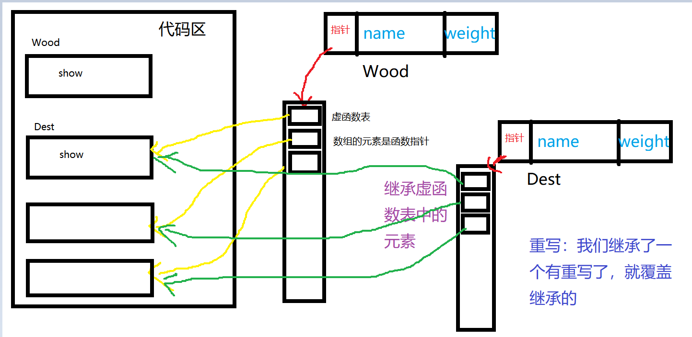

# 类

## 类的六个默认成员函数

构造函数、拷贝构造函数、析构函数、赋值操作符重载、取地址操作符重载、const修饰的取地址操作符重载


## 构造函数、析构函数

<font color="pink">如果**我们不提供构造和析构，编译器会提供编译器提供的构造函数和析构函数是空实现。**</font>

- 构造函数：主要作用在于创建对象时为对象的成员属性赋值，构造函数由编译器自动调用，无须手动调用。

- 析构函数：主要作用在于对象**销毁前**系统自动调用，执行一些清理工作。

  <font color="orange">不可以手动调用构造函数，但是可以手动调用析构</font>

  <font color="skyblue">一个类只能定义一个析构函数</font>

注意1：调用无参构造函数不能加括号，如果加了编译器认为这是一个函数声明 `eg:Person p2()`

```c++
int main() {
	A fun();//声明
	fun();//调用
}

A fun() {//定义
	cout << "返回值为A类的函数" << endl;
	A a;
	return a;
}
```

```c++
class A{
public:
	A(string m):m_m(m){
		cout<< m_m <<"的构造函数的调用"<<endl; 
	}
	A(const A& p) {
		m_m = p.m_m + "的副本"; 
		cout<< m_m <<"的拷贝构造函数的调用"<<endl; 
	}
	~A(){
		cout<< m_m <<"的析构函数的调用"<<endl; 
	}
	string m_m;
};

int main()
{
	A("a0"); 
	/*a0的构造函数的调用
	a0的析构函数的调用*/
    ----------------------------------------------------------------------
	A a1("a1");
	A a2 = a1; 
	/*a1的构造函数的调用
	a1的副本的拷贝构造函数的调用
	
	a1的副本的析构函数的调用
	a1的析构函数的调用*/
    ----------------------------------------------------------------------
	A a3("a3");
	A a4(a3);
	/*a3的构造函数的调用
	a3的副本的拷贝构造函数的调用
	
	a3的副本的析构函数的调用
	a3的析构函数的调用*/
}
```

## 初始化列表方式初始化

```c++
 Person(int a, int b, int c) :m_A(a), m_B(b), m_C(c) {}
```

## 深拷贝与浅拷贝

浅拷贝：简单的赋值拷贝操作

深拷贝：在堆区重新申请空间，进行拷贝操作

```c++
//拷贝构造函数  
	Person(const Person& p) {
		cout << "拷贝构造函数!" << endl;
		//如果不利用深拷贝在堆区创建新内存，会导致浅拷贝带来的重复释放堆区问题
		m_age = p.m_age;
		m_height = new int(*p.m_height);
	}//类属性有 指针时需深拷贝
```

## <font color="orange">调用拷贝构造的情况</font>

用一个对象去初始化同一类的另一个新对象时

函数的返回值是类的对象，函数执行返回调用时	

函数的形参是类的对象，调用函数进行形参和实参结合时


## 静态成员

静态成员就是在成员变量和成员函数前加上关键字static，称为静态成员

静态成员分为：

- 静态成员变量
  - 所有对象共享同一份数据
  - 在编译阶段分配内存
  - 类内声明，类外初始化
- 静态成员函数
  - 所有对象共享同一个函数
  - <font color="orange">静态成员函数**只能访问静态成员变量**</font>

```c++
class Person
{
public:
	static int m_A; //静态成员变量
private:
	static int m_B; //静态成员变量也是有访问权限的
};
int Person::m_A = 10;
int Person::m_B = 10;
```

### 静态成员变量两种访问方式

1、通过对象 p1.m_A

2、通过类名 Person::m_A

//静态成员也是有访问权限的


## 对象模型和this指针

每个成员函数都有一个指针形参，它的名字是固定的，叫做this指针。this指针是隐式的，并且它是成员函数的第一个参数。<font color="orange">要注意的是构造函数、友元函数比较特殊，它没有this指针；</font>

### this指针的用途：

- 当形参和成员变量同名时，可用this指针来区分
- 在类的非静态成员函数中返回对象本身，可使用return *this

```c++
class Person
{
public:
	Person(int age)
	{
		//1、当形参和成员变量同名时，可用this指针来区分
		this->age = age;
	}
	Person& PersonAddPerson(Person p)
	{
		this->age += p.age;
		//返回对象本身
		return *this;
	}
	int age;
};
```

### 空指针访问成员函数

C++中空指针也是可以调用成员函数的，但是也要注意有没有用到this指针

如果用到this指针，需要加以判断保证代码的健壮性

```c++
class Person {
public:
	void ShowClassName() {
		cout << "我是Person类!" << endl;
	}
	void ShowPerson() {
		if (this == NULL) {//判断是否为NULL，可以来解决报错的问题
			return;
		}
		cout << mAge << endl;
	}
public:
	int mAge;
};
void test01()
{
	Person* p = NULL;
	p->ShowClassName(); //空指针，可以调用成员函数
	p->ShowPerson();  //但是如果成员函数中用到了this指针，就会报错 访问权限冲突
}
```

###  const修饰成员函数

**常函数：**

- 成员函数后加const后我们称为这个函数为**常函数**
- 常函数内不可以修改成员属性
- <font color="pink">成员属性声明时加关键字mutable后，在常函数中依然可以修改</font>

**常对象：**

- 声明对象前加const称该对象为常对象
- <font color="pink">常对象只能调用常函数</font>

```c++
class Person {
public:
	Person() {
		m_A = 0;
		m_B = 0;
	}
	//this指针的本质是一个指针常量，指针的指向不可修改
	//如果想让指针指向的值也不可以修改，需要声明常函数
	void ShowPerson() const {
		//const Type* const pointer;
		//this = NULL; //不能修改指针的指向 Person* const this;
		//this->mA = 100; //但是this指针指向的对象的数据是可以修改的

		//const修饰成员函数，表示指针指向的内存空间的数据不能修改，除了mutable修饰的变量
		this->m_B = 100;
	}
	void MyFunc() const {
		//mA = 10000;
	}
public:
	int m_A;
	mutable int m_B; //可修改 可变的
};
//const修饰对象  常对象
void test01() {
	const Person person; //常量对象  
	cout << person.m_A << endl;
	//person.mA = 100; //常对象不能修改成员变量的值,但是可以访问
	person.m_B = 100; //但是常对象可以修改mutable修饰成员变量

	//常对象访问成员函数
	person.MyFunc(); //常对象只能调用const的函数
}
```

## 友元

友元的目的就是让一个函数或者类 访问另一个类中私有成员

友元的关键字为 friend

友元的声明可以放在类的任何一个区域(公有、保护、私有)。<font color="orange">但是友元的实现不可以在类内部。</font>

<font color="orange">友元函数中不能使用this指针来访问类成员变量。</font>

### 友元的三种实现

- 全局函数做友元
- 类做友元
- 成员函数做友元

```c++
class Building {
    //告诉编译器 goodGay全局函数 是 Building类的好朋友，可以访问类中的私有内容 
    friend void goodGay(Building * building);
}
```

```c++
class Building
{
	//告诉编译器 goodGay类是Building类的好朋友，可以访问到Building类中私有内容
	friend class goodGay;
}
```

```c++
class Building
{
	//告诉编译器  goodGay类中的visit成员函数 是Building好朋友，可以访问私有内容
	friend void goodGay::visit();
}
```

## 运算符重载

运算符重载概念：对已有的运算符重新进行定义，赋予其另一种功能，以适应不同的数据类型

**运算符重载是多态性的一种表现**	

**对于运算符的重载，通常有两种形式。**
1、操作结果 operator 运算符(操作数1,[操作数2]) **两个操作数必须至少有一个自定义类**
2、操作结果 类::operator 运算符(操作数)

1.不能改变运算符的优先级。
2.不能改变运算符的结合性。
3.默认参数不能和重载的运算符一起使用，也就是说，<font color="orange">在设计运算符重载成员函数时不能使用默认函数。</font>
4.不能改变运算符的操作数的个数。
5.不能创建新的运算符，只有已有运算符可以被重载
6.运算符作用于C++内部提供的数据类型时，原来含义保持不变

`限制 "."，".*"，"->*"，"::"，"?:"，"sizeof"等操作符的重载。`<font color="pink">(带* . 的都不行)</font>

**必须在作为类成员函数重载的运算符：“=”、“[ ]”、“（）”、“->”**

**输入输出运算符不能重载为类的成员函数**

```c++
ostream& operator<<(ostream&,const 类对象引用)
istream& operator>>(istream&,类对象的引用)
```

### 重载加法运算符

```c++
//成员函数实现 + 号运算符重载
//类中含有两个成员变量 int m_A;int m_B; 
	Person operator+(const Person& p) {
		Person temp;
		temp.m_A = this->m_A + p.m_A;
		temp.m_B = this->m_B + p.m_B;
		return temp;
	}

//全局函数实现 + 号运算符重载
    Person operator+(const Person& p1, const Person& p2) {
        Person temp(0, 0);
        temp.m_A = p1.m_A + p2.m_A;
        temp.m_B = p1.m_B + p2.m_B;
        return temp;
    }

//运算符重载 可以发生函数重载 
    Person operator+(const Person& p2, int val)  
    {
        Person temp;
        temp.m_A = p2.m_A + val;
        temp.m_B = p2.m_B + val;
        return temp;
    }

//调用
	Person p1(10, 10);
	Person p2(20, 20);

	//成员函数方式
	Person p3 = p2 + p1;  //相当于 p2.operaor+(p1)
```

### 重载左移运算符

```c++
class Person {
	friend ostream& operator<<(ostream& out, Person& p);
public:
	Person(int a, int b)
	{
		this->m_A = a;
		this->m_B = b;
	}
	//成员函数 实现不了  p << cout 不是我们想要的效果
	//void operator<<(Person& p){
	//}
private:
	int m_A;
	int m_B;
};
//全局函数实现左移重载
//ostream对象只能有一个
ostream& operator<<(ostream& out, Person& p) {
	out << "a:" << p.m_A << " b:" << p.m_B;
	return out;
}

void test() {
	Person p1(10, 20);
	cout << p1 << "hello world" << endl; //链式编程
}
```

总结：重载左移运算符配合友元可以实现输出自定义数据类型

### 重载递增运算符

```c++
class MyInteger {
public:
	MyInteger() {
		m_Num = 0;
	}
	//前置++
	MyInteger& operator++() {
		//先++
		m_Num++;
		//再返回
		return *this;
	}

	//后置++
	MyInteger operator++(int) {
		//先返回
		MyInteger temp = *this; //记录当前本身的值，然后让本身的值加1，但是返回的是以前的值，达到先返回后++；
		m_Num++;
		return temp;
	}

private:
	int m_Num;
};
```

总结： 前置递增返回引用，后置递增返回值

### 重载赋值运算符

```c++
class Person
{
public:
	Person(int age)
	{
		//将年龄数据开辟到堆区
		m_Age = new int(age);
	}
	//重载赋值运算符 
	Person& operator=(Person &p)
	{
		if (m_Age != NULL)
		{
			delete m_Age;
			m_Age = NULL;
		}
		//编译器提供的代码是浅拷贝
		//m_Age = p.m_Age;

		//提供深拷贝 解决浅拷贝的问题
		m_Age = new int(*p.m_Age);

		//返回自身
		return *this;
	}
	~Person()
	{
		if (m_Age != NULL)
		{
			delete m_Age;
			m_Age = NULL;
		}
	}
	//年龄的指针
	int *m_Age;
};
```

**赋值运算符只能通过成员函数的方式进行重载**

### 重载关系运算符

```c++
class Person
{
public:
	Person(string name, int age)
	{
		this->m_Name = name;
		this->m_Age = age;
	};

	bool operator==(Person & p)
	{
		if (this->m_Name == p.m_Name && this->m_Age == p.m_Age)
		{
			return true;
		}
		else
		{
			return false;
		}
	}

	bool operator!=(Person & p)
	{
		if (this->m_Name == p.m_Name && this->m_Age == p.m_Age)
         {
			return false;
		}
		else
		{
			return true;
		}
	}

	string m_Name;
	int m_Age;
};
```

### 重载函数调用运算符

- 函数调用运算符 () 也可以重载
- 由于重载后使用的方式非常像函数的调用，因此称为仿函数
- 仿函数没有固定写法，非常灵活

```c++
class MyPrint
{
public:
	void operator()(string text)
	{
		cout << text << endl;
	}
};
void test01()
{
	//重载的（）操作符 也称为仿函数
	MyPrint myFunc;
	myFunc("hello world");
}


class MyAdd
{
public:
	int operator()(int v1, int v2)
	{
		return v1 + v2;
	}
};

void test02()
{
	MyAdd add;
	int ret = add(10, 10);
	cout << "ret = " << ret << endl;

	//匿名对象调用  
	cout << "MyAdd()(100,100) = " << MyAdd()(100, 100) << endl;
}
```

## 继承

继承的好处：可以减少重复的代码

class A : public B;

A 类称为子类 或 派生类

B 类称为父类 或 基类

**派生类中的成员，包含两大部分**：

一类是从基类继承过来的，一类是自己增加的成员。

从基类继承过过来的表现其共性，而新增的成员体现了其个性。


**结论： 父类中私有成员也是被子类继承下去了，只是由编译器给隐藏后访问不到**

如果不显式地给出继承方式，<font color="pink">缺省的继承方式是私有继承。</font>

```C++
class A {
public:
	int a;
};
class B : A{

};
```


### 继承中构造和析构顺序

建立派生类对象时，构造函数的执行顺序是，执行**虚拟基类**的构造函数，再是**非虚拟基类**然后执行**派生类成员对象**的构造函数，执行**派生类的构造函数**。最后是**非类对象成员**。

```c++
class Base 
{
public:
	Base()
	{
		cout << "Base构造函数!" << endl;
	}
	~Base()
	{
		cout << "Base析构函数!" << endl;
	}
};

class Son : public Base
{
public:
	Son()
	{
		cout << "Son构造函数!" << endl;
	}
	~Son()
	{
		cout << "Son析构函数!" << endl;
	}
};
int main() {
	Son s; 
}
输出：
    Base构造函数!
    Son构造函数!
    Son析构函数!
    Base析构函数!
```

### 继承同名成员处理方式

问题：当子类与父类出现同名的成员，如何通过子类对象，访问到子类或父类中同名的数据呢？

- 访问子类同名成员 直接访问即可
- 访问父类同名成员 需要加作用域
- 同名静态成员处理方式和非静态处理方式一样，只不过有两种访问的方式（通过对象 和 通过类名）

### 继承中析构函数的奇妙特点

```c++
class Base {
public:
	Base() {
		cout << "调用Base的构造函数" << endl;
	}
	~Base()
	{
		cout << "调用Base的析构函数" << endl;
	}
};
class Son :public Base{
public:
	Son() {
		cout << "调用Son的构造函数" << endl;
	}
	~Son()
	{
		cout << "调用Son的析构函数" << endl;
	}
};
class Grandson :public Son{
public:
	Grandson() {
		cout << "调用Grandson的构造函数" << endl;
	}
	~Grandson()
	{
		cout << "调用Grandson的析构函数" << endl;
	}
};

int main() {
	Grandson s;
	/*
	调用Base的构造函数
	调用Son的构造函数
	调用Grandson的构造函数
	调用Grandson的析构函数
	调用Son的析构函数
	调用Base的析构函数
	*/
	s.~Grandson();
	/*
	调用Grandson的析构函数
	调用Son的析构函数
	调用Base的析构函数
	*/
	return 0;
}
```

**总结：调用类对象自己析构函数之后会自动调用 父类的 析构函数**

### 继承中遇到的构造函数问题

总结：

子类在构造时，如果没有显式调用父类的构造函数，会先调用父类的默认构造函数（无参数的）

```c++
#include <iostream>
class Base{
public:
	Base(int a){}
};
class Derive:public Base{
public:
	Derive(int a,int b):Base(a){}//除了 父类有 无参构造函数时，不用这种写法，其他情况都需要有 父类初始化
};

int main(){
Derive c(1,2);
return 0;
}
```

### 虚继承

在采用虚基类时，其成员将仅存唯一的副本，这样就可以解决二义性问题，但不能够实现运行时多态，可通过抽象类或虚拟函数来实现，虚基类的构造函数将会首先被执行。


## 多态

### 多态的基本概念

**多态是C++面向对象三大特性之一**

多态分为两类

- 静态多态: 函数重载 和 运算符重载属于静态多态，复用函数名
- 动态多态: 派生类和虚函数实现运行时多态

静态多态和动态多态区别：

- 静态多态的函数地址早绑定 - 编译阶段确定函数地址
- 动态多态的函数

地址晚绑定 - 运行阶段确定函数地址


### 虚函数

虚函数是一种单界面多实现版本的实现方法，即函数名、返回类型、函数类型和个数顺序完全相同，但函数体内容可以完全不同。

基类中采用virtual说明一个虚函数后，<font color="orange">派生类中定义相同原型函数时可不必加virtual说明</font>

<font color="pink">虚函数不允许说明成静态的成员函数</font>


## 纯虚函数和抽象类

在多态中，通常父类中虚函数的实现是毫无意义的，主要都是调用子类**重写**的内容

因此可以将虚函数改为**纯虚函数**

纯虚函数语法：`virtual 返回值类型 函数名 （参数列表）= 0 ;`

当类中有了纯虚函数，这个类也称为抽象类

**抽象类特点**：

- 无法实例化对象
- 子类必须重写抽象类中的纯虚函数，否则也属于抽象类

```c++
class Base
{
public:
	virtual void func() = 0;
};

class Son :public Base
{
public:
	virtual void func() 
	{
		cout << "func调用" << endl;
	};
};

void test01()
{
	Base * base = NULL;
	//base = new Base; // 错误，抽象类无法实例化对象
	base = new Son;
	base->func();
	delete base;//记得销毁
}
```

### 虚析构和纯虚析构

多态使用时，如果子类中有属性开辟到堆区，那么父类指针在释放时无法调用到子类的析构代码

解决方式：将父类中的析构函数改为**虚析构**或者**纯虚析构**

虚析构和纯虚析构共性：

- 可以解决父类指针释放子类对象
- 都需要有具体的函数实现

虚析构和纯虚析构区别：

- 如果是纯虚析构，该类属于抽象类，无法实例化对象

虚析构语法：

```c++
virtual ~类名(){}
```

纯虚析构语法：

```c++
virtual ~类名() = 0;
类名::~类名(){}
```

```c++
class Animal {
public:
	Animal()
	{
		cout << "Animal 构造函数调用！" << endl;
	}
	virtual void Speak() = 0;

	//析构函数加上virtual关键字，变成虚析构函数
	//virtual ~Animal()
	//{
	//	cout << "Animal虚析构函数调用！" << endl;
	//}
	virtual ~Animal() = 0;
};
Animal::~Animal()
{
	cout << "Animal 纯虚析构函数调用！" << endl;
}

//和包含普通纯虚函数的类一样，包含了纯虚析构函数的类也是一个抽象类。不能够被实例化。

class Cat : public Animal {
public:
	Cat(string name)
	{
		cout << "Cat构造函数调用！" << endl;
		m_Name = new string(name);
	}
	virtual void Speak()
	{
		cout << *m_Name <<  "小猫在说话!" << endl;
	}
	~Cat()
	{
		cout << "Cat析构函数调用!" << endl;
		if (this->m_Name != NULL) {
			delete m_Name;
			m_Name = NULL;
		}
	}
public:
	string *m_Name;
};

void test01()
{
	Animal *animal = new Cat("Tom");
	animal->Speak();

	//通过父类指针去释放，会导致子类对象可能清理不干净，造成内存泄漏
	//怎么解决？给基类增加一个虚析构函数
	//虚析构函数就是用来解决通过父类指针释放子类对象
	delete animal;
}
int main() {
	test01();
	system("pause");
	return 0;
}
```

总结：

  1. 虚析构或纯虚析构就是用来解决通过父类指针释放子类对象

  2. 如果子类中没有堆区数据，可以不写为虚析构或纯虚析构

  3. 拥有纯虚析构函数的类也属于抽象类


## 多态案例

```c++
#include <iostream>
using namespace std;
#include<string>
//木材
class Wood {
protected:
	string name;
	int weight;
public:
	Wood(string n ,int w):name(n),weight(w){}
	virtual void Show() {//虚函数
		cout << "这是一块重" << weight << "kg的" << name << endl;
	}
};
//凳子
class Stool :public Wood{
public:
	Stool(string n , int w):Wood(n,w){}
	void Show() {//虚函数
		cout << "这是用一块重" << weight << "kg的" << name << "做的凳子" << endl;
	}
};
//桌子
class Dest :public Wood {
public:
	Dest(string n, int w) :Wood(n, w) {}
	void Show() {//虚函数
		cout << "这是用一块重" << weight << "kg的" << name << "做的桌子" << endl;
	}
};

void test(Wood* p) {
	p->Show();
}

int main() {
	Wood w1("橡木", 5), w2("楠木", 6);
	Stool s1("橡木", 5), s2("楠木", 6);
	Dest d1("橡木", 5), d2("楠木", 6);

	w1.Show();
	w2.Show();
	cout << "------------------------------" << endl;
	s1.Show();
	s2.Show();
	cout << "------------------------------" << endl;
	d1.Show();
	d2.Show();

	/*
	这是一块重5kg的橡木
	这是一块重6kg的楠木
	------------------------------
	这是用一块重5kg的橡木做的凳子
	这是用一块重6kg的楠木做的凳子
	------------------------------
	这是用一块重5kg的橡木做的桌子
	这是用一块重6kg的楠木做的桌子
	*/

	cout << "------------------------------" << endl;
	Wood* p;//多肽的体现 同样的指针有不同的结果
	p = &w1;
	test(p);
	cout << "------------------------------" << endl;
	p = &s1;
	test(p);
	cout << "------------------------------" << endl;
	p = &d1;
	test(p);

	/*这是一块重5kg的橡木
	------------------------------
	这是用一块重5kg的橡木做的凳子
	------------------------------
	这是用一块重5kg的橡木做的桌子*/
    
    /*如果没加virtual 则全为“这是一块重5kg的橡木”*/
    
    //引用也可以
    Dest d1("楠木", 10);
	Wood* W1;
	W1 = &d1;
	W1->Show();
    
	return 0;
}
```

**多肽的实现靠的是虚函数表**



虚函数表是链表

## 重载、重写、重定义

**函数重载（overload）**
函数重载是指在一个类中声明多个名称相同但参数列表不同的函数，这些的参数可能个数或顺序，类型不同，但是不能靠返回类型来判断。特征是：
（1）相同的范围（在同一个作用域中）；
（2）函数名字相同；
（3）参数不同；
（4）virtual 关键字可有可无（注：函数重载与有无virtual修饰无关）；
（5）返回值可以不同；

**函数重写（也称为覆盖 override）**
函数重写是指子类重新定义基类的虚函数。特征是：
（1）不在同一个作用域（分别位于派生类与基类）；
（2）函数名字相同；
（3）参数相同；
（4）基类函数必须有 virtual 关键字，不能有 static 。
（5）返回值相同，否则报错；
（6）重写函数的访问修饰符可以不同；

**重定义（也称隐藏）**
（1）不在同一个作用域（分别位于派生类与基类） ；
（2）函数名字相同；
（3）返回值可以不同；
（4）参数不同。此时，不论有无 virtual 关键字，基类的函数将被隐藏（注意别与重载以及覆盖混淆）；
（5）参数相同，但是基类函数没有 virtual关键字。此时，基类的函数被隐藏（注意别与覆盖混淆）；

## 其他

```c++
class Name{
   char name[20];
public:
   Name(){
      strcpy(name,"");
   }
   Name(char *fname){
      strcpy(name,fname);
   }
};
```

### 类中有char*案例

```c++
#include<iostream>
using namespace std;
#include<cstring>

class String{
private:
	char* buf;
public:
	String(char* sorce){
		buf = new char[strlen(sorce)+1];
		strcpy(buf,sorce);
		buf[strlen(sorce)+1]='\0';
	}
	bool operator==(String& s){
		cout<<"this:"<< this->buf <<endl;
		cout<<"s:"<< s.buf <<endl;
		cout<<"this的地址: "<< &(this->buf)<<endl; 
		cout<<"s的地址: "<< &(s.buf) <<endl; 
		cout<<"类里的bool值:"<<(this->buf==s.buf)<<endl; 
		if(strcmp(this->buf,s.buf)==0) return true;
		return false;
	}
	~String(){
		delete []buf;
		buf =NULL;
	} 
};
int main(){
	char* a="abc";
	char* b="abc";	
    cout<< (a==b) <<endl;
	cout<<"a的地址: "<< &a<<endl; 
	cout<<"b的地址: "<< &b<<endl; 
	String s1(a),s2(b);
	if(s1==s2)cout<<"true"<<endl;
	else cout<<"false"<<endl; 
	return 0; 
}
输出：
1
a的地址: 0x6bfeec
b的地址: 0x6bfee8
this:abc
s:abc
this的地址: 0x6bfee4
s的地址: 0x6bfee0
类里的bool值:0
true
```

